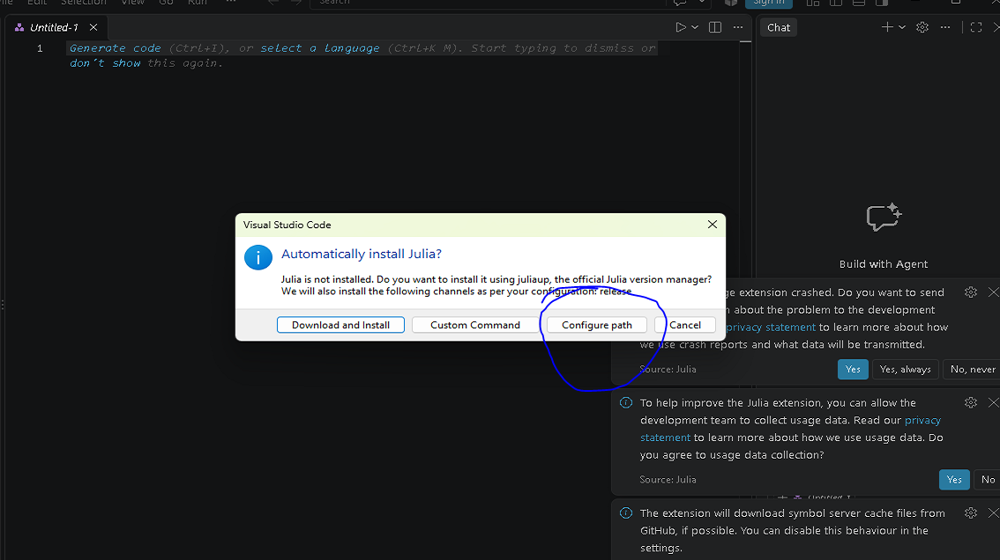
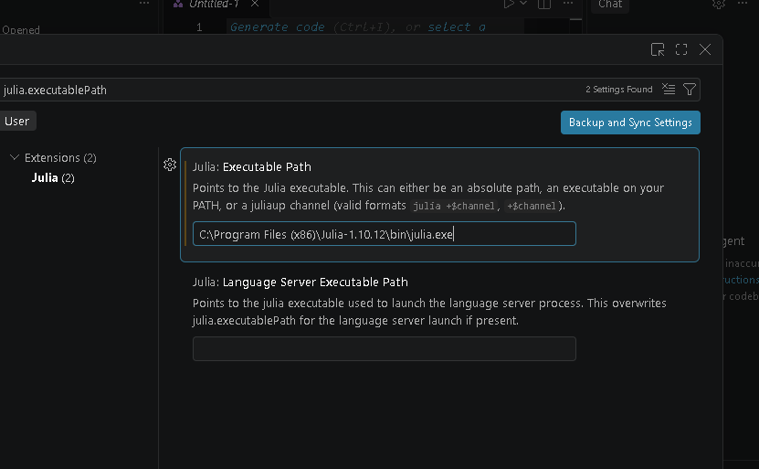

# Installing Julia and VS Code — and fixing common problems

Short help for the first week. The goal is that you can create, write, run and
save a Julia program file, so you can do the first homework.

## What to install
- **Julia** through Juliaup (channel 1.12): <https://julialang.org/install/>.
- **Visual Studio Code** and its official **Julia** extension:
  <https://code.visualstudio.com/>.
- **Git** — only needed to clone the repository. If you do not have it, use the
  repository's **Code → Download ZIP** button instead.

Lab computers may already have Julia installed, possibly with a different 1.x
version. Use the executable that is installed (see below) rather than
installing a second copy.

## The Julia executable path (the most common problem)
The first time you open a `.jl` file, the Julia extension may ask to install
Julia. Do **not** download Julia again. Choose **Configure path**.



Then, in the field **Julia: Executable Path**, paste the full path to the `julia`
executable. On a lab Windows machine it looks like this:

```
C:\Program Files (x86)\Julia-1.10.12\bin\julia.exe
```



You can also open the setting from the command palette: `Ctrl+Shift+P` →
**Preferences: Open Settings (UI)** → search for `julia.executablePath`.

## Running a program in VS Code
1. Open the course folder: **File → Open Folder** and choose the cloned folder.
2. Create a file, for example `hello.jl`.
3. Write `println("hello")` and save it (`Ctrl+S`).
4. Run it with **Run → Run Without Debugging** (or the ▷ button). The output
   appears in the terminal panel.

The editor is where you write and save code; the Julia REPL is the running
session. A displayed result in the editor is not the program output.

## Common problems
- **`julia` is not recognized, or VS Code cannot find Julia.** Set the
  executable path as above, or add Julia's `bin` folder to your `PATH`.
- **`using CSV` (or another package) fails.** Select the course environment:
  from the repository root run
  `julia --project=. -e 'using Pkg; Pkg.instantiate()'`, then restart the REPL.
- **The wrong Julia version starts.** Pick the installed executable in the
  setting above. The course examples were checked with Julia 1.12.6.
- **You cannot find your figure.** The script saves it in the folder you ran it
  from; print the file name in the script and open that file.
