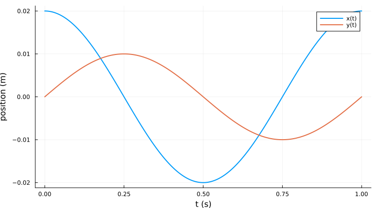
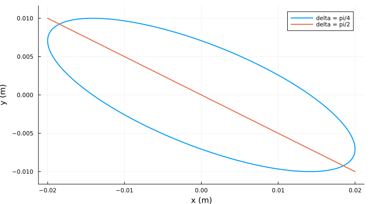
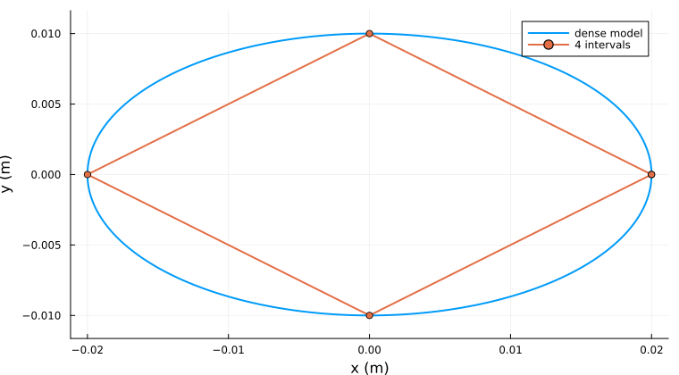
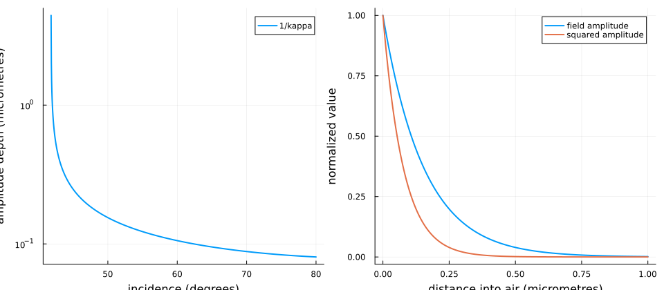
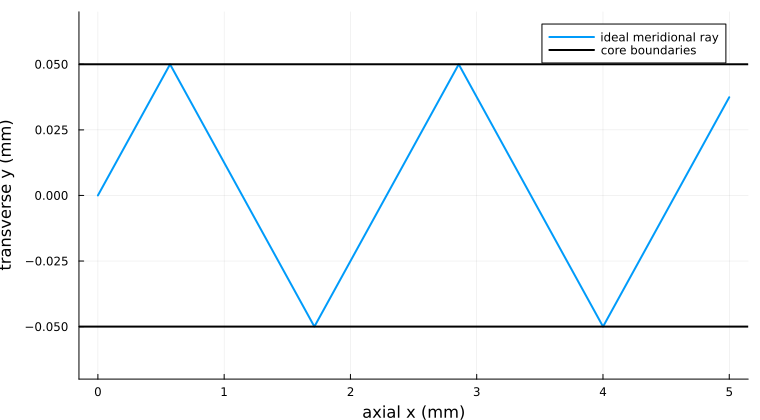
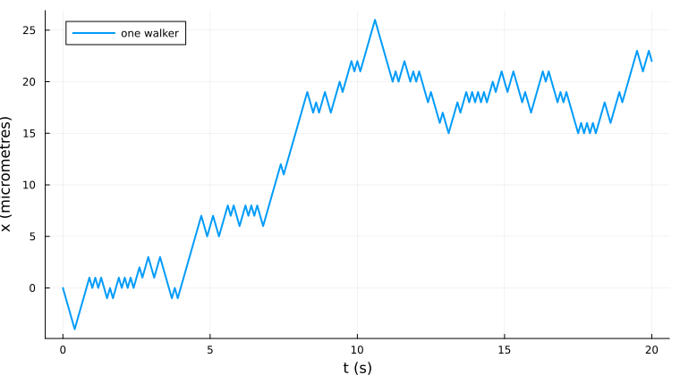
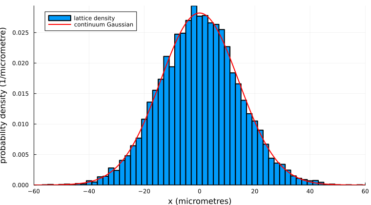

# Further explorations — Weeks 1–3

Self-contained optional physics with Julia. Start with the [index and setup](README.md). Worked answers are in [the solutions companion](solutions-en.md). Code is shared with the notebooks; all outputs below were captured during execution.

- [1. Lissajous curves: seeing frequency and phase](#week01-lissajous)
- [2. Total internal reflection: from a ray decision to a wave field](#week02-total-internal-reflection)
- [3. Random walks: how randomness produces a diffusion law](#week03-diffusion)

<a id="week01-lissajous"></a>

# 1. Lissajous curves: seeing frequency and phase

**Optional self-study · approximately 90–120 minutes, including experiments.** This exploration is unexamined, carries no extra-credit requirement, and is not a prerequisite for later work. It is separate from the Week 1 bonus. We assume scalar arithmetic and assignment; we teach the extra plotting and vector notation here as supplied tools. No function definitions are needed.

## 1.1 The physical question

Imagine a small mass attached to restoring springs in two perpendicular directions. We watch its position from above. Each coordinate may oscillate sinusoidally, yet the combined path can be an ellipse, a line, or an intricate repeating pattern. How can a two-dimensional picture tell us about two clocks?

The same mathematics describes the horizontal and vertical deflections of an oscilloscope in XY mode. In that application the coordinates represent voltages rather than lengths. A graph of one signal against another has a shared time parameter even though time is not an axis. We will learn to distinguish that **parametric curve** from two separate position-versus-time graphs.

> **Physics — two independent restoring forces.** We choose rightward $x$ and upward $y$ positive. For a mass $m$ in kg, $F_x=-k_xx$ and $F_y=-k_yy$, where $k_x,k_y>0$ are spring constants in N/m. Small displacements, linear springs, negligible damping, and no coupling between directions give $m\ddot{x}=-k_xx$ and $m\ddot{y}=-k_yy$. The minus sign makes each force restoring. The origin is the equilibrium; the path is generally not a gravitational orbit. At zero displacement the restoring force in that direction vanishes. Large displacements, friction, driving, or coupling require a different model.

For one coordinate, a cosine has second derivative equal to minus itself times the square of its angular frequency. Substitution therefore gives $\omega_x=\sqrt{k_x/m}$. We choose the time origin so the $y$ oscillation has zero sine phase:

$$x(t)=A\cos(\omega_x t+\delta),\qquad y(t)=B\sin(\omega_y t).$$

Here $A,B$ are positive amplitudes in m, $t$ is in s, $\omega_x,\omega_y$ are positive angular frequencies in rad/s, and $\delta$ is in radians. One full turn is $2\pi$ radians. Ordinary frequency is $f=\omega/(2\pi)$ in Hz, and period is $T=1/f$. We start with $A=0.02$ m and $B=0.01$ m: stretching one axis should stretch the picture without changing its timing.

> **Mathematics — phase is a position within a cycle.** Adding $2\pi$ to a phase changes no observable value. With our cosine/sine convention, $\delta=0$ does **not** mean the coordinates are in phase: cosine already leads sine by a quarter cycle. Always write the actual sine/cosine definitions before interpreting the sign of a phase.

## 1.2 One instant, then an entire motion

We load the already installed plotting package. `using` makes its tools available; `gr()` selects its graphics backend. `default` supplies presentation settings. `Printf` provides formatted output: `%.2f` prints two decimal places, while the stored value keeps full precision. These setup choices change appearance, not physics.

```julia
using Plots
using Printf
gr()
default(size = (760, 420), linewidth = 2, legend = :topright)
println("Plots ready; coordinates in metres, time in seconds.")
```

```{.output}
Plots ready; coordinates in metres, time in seconds.
```

Before running the next example, evaluate it mentally: after a quarter second at 1 Hz, cosine is zero and sine is one. We expect $x=0$ and $y=B$.

```julia
A = 0.02
B = 0.01
omega_x = 2pi
omega_y = 2pi
delta = 0.0
t = 0.25
x = A * cos(omega_x * t + delta)
y = B * sin(omega_y * t)
@printf("t = %.2f s: x = %.5f m, y = %.5f m\n", t, x, y)
```

```{.output}
t = 0.25 s: x = 0.00000 m, y = 0.01000 m
```

A displayed zero here is rounded; the computed cosine may be about $6\times10^{-17}$ rather than exactly zero. That is floating-point evaluation of a mathematical identity, not a detectable physical displacement.

> **Julia — a small plotting vocabulary.** `range(0.0, 1.0; length = 501)` supplies 501 equally spaced times, including both endpoints. `length` counts them and `step` reports the spacing. A vector holds one value for each time. The dots in `cos.(...)`, `.*`, and `.+` mean “apply this operation separately to every entry.” For example, squaring the entries 2 and 3 produces 4 and 9; it is not a matrix product. `plot(times, xs)` pairs the first time with the first position, and so on. `plot!` adds a series to an existing figure. `display` shows a figure explicitly, including when the example is run as a script.

```julia
times = range(0.0, 1.0; length = 501)
xs = A .* cos.(omega_x .* times .+ delta)
ys = B .* sin.(omega_y .* times)
@printf("%d samples; dt = %.4f s\n", length(times), step(times))
p_time = plot(times, xs; label = "x(t)", xlabel = "t (s)", ylabel = "position (m)")
plot!(p_time, times, ys; label = "y(t)")
display(p_time)
p_orbit = plot(xs, ys; label = "equal frequencies", xlabel = "x (m)",
    ylabel = "y (m)", aspect_ratio = :equal)
display(p_orbit)
```

```{.output}
501 samples; dt = 0.0020 s
```




The first figure keeps the two clocks visible. The second eliminates time from the axes and follows the coordinate pair. Its equal aspect ratio is important: one metre has the same visual length on both axes. With $A\ne B$ we expect an ellipse, not a circle. Connected points are samples of the analytic model, not new measurements or the output of an ODE solver.

## 1.3 Deriving the equal-frequency ellipse

For equal angular frequencies write $u=\omega t$, $X=x/A$, and $Y=y/B$. The addition formula gives

$$X=\cos u\cos\delta-\sin u\sin\delta,
\qquad X+Y\sin\delta=\cos u\cos\delta.$$

Squaring and using $\cos^2u=1-Y^2$ gives

$$\boxed{X^2+Y^2+2XY\sin\delta=\cos^2\delta.}$$

At $\delta=0$ this is the familiar ellipse $X^2+Y^2=1$. At $\delta=\pi/2$ it becomes $(X+Y)^2=0$, so the curve collapses to the line $X=-Y$. At $\delta=-\pi/2$ the line instead has positive slope. For intermediate phases the ellipse is tilted. These are geometric consequences of phase, not evidence that energy has been lost.

Predict the two shapes in the next figure. The residual is the left-hand side minus the right-hand side of the boxed equation, evaluated at every sampled point. `abs.` takes absolute values and `maximum` finds the largest. Powers with dots are entrywise powers. A tiny residual checks the derivation and the code together.

```julia
delta = pi / 4
xs = A .* cos.(omega_x .* times .+ delta)
ys = B .* sin.(omega_y .* times)
X = xs ./ A
Y = ys ./ B
ellipse_residual = X .^ 2 .+ Y .^ 2 .+ 2 .* X .* Y .* sin(delta) .- cos(delta)^2
@printf("Largest ellipse-equation residual: %.2e\n", maximum(abs.(ellipse_residual)))
p_phase = plot(xs, ys; label = "delta = pi/4", xlabel = "x (m)",
    ylabel = "y (m)", aspect_ratio = :equal)
plot!(p_phase, A .* cos.(omega_x .* times .+ pi / 2), ys; label = "delta = pi/2")
display(p_phase)
```

```{.output}
Largest ellipse-equation residual: 6.66e-16
```



The line at a quarter-cycle phase and the tilted ellipse agree with the derivation. The residual's last digits can vary with numerical libraries; its scale should remain near machine precision. The collapsed line is traversed back and forth: a path's shape alone does not reveal its direction or speed.

## 1.4 Why some patterns close

For the **full state** to repeat, both positions and velocities must repeat. A sufficient and, for nonzero amplitudes and positive frequencies, necessary condition is that both oscillator phases advance by integer numbers of cycles:

$$\omega_x T=2\pi p,\qquad \omega_y T=2\pi q,$$

for positive integers $p,q$. Dividing shows that $\omega_x/\omega_y=p/q$ must be rational. If $p$ and $q$ share no factor and $\omega_x=p\Omega$, $\omega_y=q\Omega$, the fundamental state period is $2\pi/\Omega$.

For $f_x=3$ Hz and $f_y=2$ Hz, the state repeats after one second. The velocities follow by differentiation:

$$v_x=-A\omega_x\sin(\omega_xt+\delta),\qquad
v_y=B\omega_y\cos(\omega_yt).$$

We compare both ends of the sampled interval. `xs[1]` is the first entry and `xs[end]` is the last; `hypot(dx,dy)` computes $\sqrt{dx^2+dy^2}$. Endpoint position agreement alone could also describe an accidental crossing.

```julia
omega_x = 3 * 2pi
omega_y = 2 * 2pi
delta = 0.3
times = range(0.0, 1.0; length = 1501)
xs = A .* cos.(omega_x .* times .+ delta)
ys = B .* sin.(omega_y .* times)
vx = -A .* omega_x .* sin.(omega_x .* times .+ delta)
vy = B .* omega_y .* cos.(omega_y .* times)
@printf("Position closure error: %.2e m\n", hypot(xs[end] - xs[1], ys[end] - ys[1]))
@printf("Velocity closure error: %.2e m/s\n", hypot(vx[end] - vx[1], vy[end] - vy[1]))
display(plot(xs, ys; label = "3:2, T = 1 s", xlabel = "x (m)",
    ylabel = "y (m)", aspect_ratio = :equal))
```

```{.output}
Position closure error: 2.14e-17 m
Velocity closure error: 1.28e-15 m/s
```


The small position **and** velocity mismatches support the predicted period. A crossing inside the curve usually occurs with different velocities on the two passages. It is not a return of the complete physical state.

> **Check — closure is not resonance.** We have specified free oscillations, with no periodic driving force. Rational frequency ratios make a picture repeat; they do not by themselves imply resonant energy absorption. A driven oscillator requires an equation with an external force and, usually, damping.

## 1.5 Nearly equal clocks and apparent nonclosure

Suppose the frequencies are 1.01 Hz and 1 Hz. Their relative phase changes at $\Delta\omega=0.01(2\pi)$ rad/s, completing a cycle in

$$T_{\rm relative}=\frac{2\pi}{|\Delta\omega|}=100\ {\rm s}.$$

Over one second the figure looks almost like an ellipse. Over 100 seconds it draws many strands. Yet 1.01 is the rational number 101/100 in the mathematical model, so this example eventually closes. We use two plots side by side: `layout = (1, 2)` means one row and two columns.

```julia
omega_x = 1.01 * 2pi
omega_y = 2pi
delta = 0.0
short_t = range(0.0, 1.0; length = 1001)
long_t = range(0.0, 100.0; length = 100001)
@printf("Relative-phase cycle: %.1f s\n", 2pi / abs(omega_x - omega_y))
p_short = plot(A .* cos.(omega_x .* short_t), B .* sin.(omega_y .* short_t);
    label = "first second", xlabel = "x (m)", ylabel = "y (m)", aspect_ratio = :equal)
p_long = plot(A .* cos.(omega_x .* long_t), B .* sin.(omega_y .* long_t);
    label = "100 seconds", xlabel = "x (m)", ylabel = "y (m)", aspect_ratio = :equal)
display(plot(p_short, p_long; layout = (1, 2), size = (960, 400)))
```

```{.output}
Relative-phase cycle: 100.0 s
```


An exactly irrational frequency ratio has no finite full-state period. Ideal motion with such a ratio densely visits the allowed rectangle over arbitrarily long times, although any finite plotted segment is only a curve. Neither a crowded figure nor finite-precision decimal frequencies can prove irrationality. Frequency measurements also have uncertainty. We can report recurrence within a stated tolerance and observation window, not establish an infinite-time theorem by a finite experiment.

## 1.6 Can plotting invent a shape?

The computer draws straight segments between sampled points. Four intervals around an ellipse produce a diamond-like polygon. The motion equation did not change; only our representation did.

```julia
coarse_t = range(0.0, 1.0; length = 5)
fine_t = range(0.0, 1.0; length = 1001)
p_alias = plot(A .* cos.(2pi .* fine_t), B .* sin.(2pi .* fine_t);
    label = "dense model", xlabel = "x (m)", ylabel = "y (m)", aspect_ratio = :equal)
plot!(p_alias, A .* cos.(2pi .* coarse_t), B .* sin.(2pi .* coarse_t);
    marker = :circle, label = "4 intervals")
display(p_alias)
```



> **Check — sampling and aliasing.** A sinusoid sampled regularly needs a sampling frequency greater than twice its frequency to avoid the simplest aliasing ambiguity; that threshold alone does not guarantee a smooth or informative plot. Start with at least 50–100 samples per fastest cycle, then halve the time spacing. If the apparent geometry changes substantially, it was not yet resolved. Sampling exactly once per cycle can even make motion appear stationary.

## 1.7 Energy as an independent physical check

The potential energy is $U=\tfrac12 k_xx^2+\tfrac12 k_yy^2$. Including kinetic energy gives

$$E=\frac m2(v_x^2+v_y^2)+\frac m2(\omega_x^2x^2+\omega_y^2y^2)
=\frac m2(\omega_x^2A^2+\omega_y^2B^2).$$

The equality follows separately in each coordinate from $\sin^2+\cos^2=1$. Energy is constant even for a complicated or nonclosed path. The following supplied checks use `@test` for a condition that should be true and `isapprox` for floating-point agreement within an absolute tolerance. `@testset` groups results. They reuse the 3:2 arrays saved above; later frequency choices did not overwrite those arrays.

```julia
using Test
# The final semicolon hides the returned test object; its summary still prints.
@testset "Oscillator geometry" begin
    @test isapprox(x, 0.0; atol = 1e-16)
    @test isapprox(y, B; atol = 1e-16)
    @test maximum(abs.(ellipse_residual)) < 1e-12
    @test hypot(xs[end] - xs[1], ys[end] - ys[1]) < 1e-12
    @test hypot(vx[end] - vx[1], vy[end] - vy[1]) < 1e-12
    m = 0.1
    energy = 0.5 .* m .* (vx .^ 2 .+ vy .^ 2) .+
        0.5 .* m .* ((3 * 2pi)^2 .* xs .^ 2 .+ (2 * 2pi)^2 .* ys .^ 2)
    expected_energy = 0.5 * m * ((3 * 2pi)^2 * A^2 + (2 * 2pi)^2 * B^2)
    @test maximum(abs.(energy .- expected_energy)) < 1e-12
end;
```

```{.output}
Test Summary:       | Pass  Total  Time
Oscillator geometry |    6      6  0.2s
```

Passing these checks establishes agreement with our ideal model, not the accuracy of that model for a real spring. A measured decay in amplitude would motivate damping; a systematic change in frequency with amplitude would motivate a nonlinear restoring force.

## 1.8 Guided investigation and self-test

1. **Predict, then plot:** hold the frequencies equal and compare $\delta=0,\pi/4,\pi/2,-\pi/2$. Record the shape and the coordinate pair at $t=0$. Explain both line slopes using the equations.
2. **Build a period table:** for ratios 1:1, 2:1, and 3:2, choose $f_y=1$ Hz, calculate the first full-state return time, and test position and velocity at that time. Supply units. Keep at least 100 samples per fastest cycle.
3. **Change one physical quantity:** double $A$ only. Predict the change in width, height, period, and energy in the $x$ oscillator before plotting. Preserve $B$ and both frequencies.
4. **Diagnose a figure:** plot 3:2 motion with sampling intervals of 0.5 s and 0.002 s over two seconds. Explain why endpoint agreement can coexist with a misleading polygon.
5. **Open extension:** compare $\omega_x/\omega_y=\sqrt{2}$ with 1.414 over 10 s and 100 s. Write a conclusion that separates the exact mathematical model from numerical evidence.

**Deliverable for yourself:** two contrasted figures, a frequency/period table, a dimensional or energy check, and a paragraph explaining which observation was a physical effect and which was a sampling effect. Suggested answers are in the separate solutions companion; consult them after making predictions.

**Summary.** We learned parametric motion, angular frequency, phase, the equal-frequency ellipse, rational closure, detuning, and sampling ambiguity. A credible picture has a governing model, labelled axes, a time window, and checks beyond visual appearance.

**Further reading:** [OpenStax University Physics, simple harmonic motion](https://openstax.org/books/university-physics-volume-1/pages/15-1-simple-harmonic-motion); [Julia mathematical operations](https://docs.julialang.org/en/v1/manual/mathematical-operations/). The explanations above are sufficient for the investigation; these references extend it.

<a id="week02-total-internal-reflection"></a>

# 2. Total internal reflection: from a ray decision to a wave field

**Optional self-study · approximately 100–140 minutes.** This chapter is unexamined, is not a prerequisite, and is separate from the extra-credit complex-phasor bonus. We assume scalar arithmetic, degree trigonometry, and `if` branches. We explain the supplied sampling and plotting expressions locally. Wave vectors, evanescent decay, and numerical aperture are new enrichment concepts.

## 2.1 Can light reach a boundary and stay inside?

A swimming pool viewed from below can behave like a mirror at sufficiently oblique angles. Optical fibers use a related phenomenon to guide light. A simple inequality classifies a ray, but the interesting physics is why the inequality appears and what happens to the electromagnetic field on the other side.

> **Physics — our interface model.** Two homogeneous, isotropic, transparent, nonmagnetic media meet at a plane. Their positive real refractive indices are $n_1$ and $n_2$, with phase speeds $c/n_1$ and $c/n_2$. Light is monochromatic, the interface is flat on wavelength scales, and both media are initially treated as infinite half-spaces. Incidence angle $\theta_i$ and transmission angle $\theta_t$ are measured from the normal, between $0$ and $90^\circ$. Medium 1 is incident-side $z<0$; medium 2 is $z>0$. Absorption, roughness, and finite nearby boundaries need a richer model. At normal incidence the ray remains normal.

## 2.2 Deriving Snell's law from matching phase

A plane wave has phase $\mathbf{k}\cdot\mathbf{r}-\omega t$, where $\mathbf{k}$ points in the propagation direction and has magnitude $k=n\omega/c$. This vector counts how rapidly phase changes per unit distance. A crest travels while its phase stays constant.

The electric and magnetic boundary conditions must hold at every position along the interface and every time. Incident, reflected, and transmitted waves must therefore have the same frequency and the same wave-vector component parallel to the surface. Otherwise their relative phases would change along the boundary and a matching condition at one point would fail elsewhere. Consequently,

$$k_1\sin\theta_i=k_2\sin\theta_t,
\qquad \boxed{n_1\sin\theta_i=n_2\sin\theta_t.}$$

The reflected wave stays in medium 1 and reverses its normal wave-vector component, giving equality of reflection and incidence angles. Snell's law specifies direction, not the fractions of optical power reflected and transmitted; those require the amplitude boundary conditions (Fresnel coefficients).

> **Mathematics — when a real angle exists.** For $0\leq\theta_i<90^\circ$, define $q=(n_1/n_2)\sin\theta_i$. A propagating transmitted ray requires $q\leq1$. If $n_1>n_2$, the boundary is $\theta_c=\arcsin(n_2/n_1)$. For $\theta_i>\theta_c$ there is total internal reflection (TIR); at equality the transmitted direction is grazing. If $n_1\leq n_2$, no incidence angle below $90^\circ$ gives TIR in this ideal model.

## 2.3 Turning the law into a Julia decision

The setup selects the installed graphics backend and formatted numerical output. A placeholder such as `%.3f` prints three decimal places. `println` writes a message deliberately; a notebook otherwise displays the final value automatically.

```julia
using Plots
using Printf
gr()
default(size = (760, 420), linewidth = 2, legend = :topright)
println("Optics ready; angles measured from the interface normal unless stated.")
```

```{.output}
Optics ready; angles measured from the interface normal unless stated.
```

For glass with $n_1=1.50$ and air with $n_2=1.00$, predict whether $50^\circ$ produces a real transmitted angle. `sind` accepts degrees and `asind` returns degrees. We calculate $q$ before calling the inverse sine, so an impossible angle never reaches that operation.

```julia
n1 = 1.50
n2 = 1.00
theta_i_deg = 50.0
q = n1 * sind(theta_i_deg) / n2
@printf("sin(theta_t) requested by Snell: %.6f\n", q)
if q > 1.0
    println("total internal reflection: no propagating transmitted ray")
elseif q == 1.0
    println("critical angle: transmitted ray is grazing")
else
    theta_t_deg = asind(q)
    @printf("refracted ray: theta_t = %.3f degrees\n", theta_t_deg)
end
theta_c_deg = asind(n2 / n1)
@printf("critical angle = %.3f degrees\n", theta_c_deg)
```

```{.output}
sin(theta_t) requested by Snell: 1.149067
total internal reflection: no propagating transmitted ray
critical angle = 41.810 degrees
```

The critical angle is about $41.81^\circ$, below the chosen incidence. An inverse-sine domain error here would signal that we attempted the wrong physical branch; it should not be “fixed” by forcing every $q>1$ to one.

> **Check — a numerical boundary has a physical uncertainty.** The explicit `q == 1.0` branch names the ideal mathematical boundary. A value constructed through trigonometric arithmetic may fall slightly to either side because of rounding. For measurements close to critical incidence, propagate the angle and index uncertainty and report “near critical” when the range straddles one. Rounding all angles first or adding a broad numerical tolerance would move a real physical threshold.

Now lower the incidence to $30^\circ$. We expect a transmitted angle larger than incidence because the second medium has smaller index. The picture below shows **paths**, not power fractions; the incident path is traversed toward the origin, while the other paths are traversed away from it.

> **Julia — drawing sampled paths.** `range` supplies evenly spaced values of a distance parameter. `.*` scales each entry; arrays in square brackets give explicit endpoint coordinates. `plot` creates a figure and `plot!` adds lines. `aspect_ratio = :equal` gives the same visual length to equal horizontal and vertical distances. Colours and labels distinguish the three ray paths.

```julia
theta_i_deg = 30.0
theta_t_deg = asind(n1 * sind(theta_i_deg) / n2)
@printf("30-degree incidence gives %.3f-degree transmission\n", theta_t_deg)
s = range(0.0, 1.0; length = 100)
p_rays = plot([-1.0, 1.0], [0.0, 0.0]; color = :black, label = "interface",
    xlabel = "x (arbitrary length unit)", ylabel = "z (same unit)", aspect_ratio = :equal)
plot!(p_rays, [0.0, 0.0], [-1.0, 1.0]; linestyle = :dash, color = :gray, label = "normal")
plot!(p_rays, -s .* sind(theta_i_deg), -s .* cosd(theta_i_deg); label = "incident path")
plot!(p_rays, s .* sind(theta_i_deg), -s .* cosd(theta_i_deg); label = "reflected path")
plot!(p_rays, s .* sind(theta_t_deg), s .* cosd(theta_t_deg); label = "transmitted path")
display(p_rays)
```

```{.output}
30-degree incidence gives 48.590-degree transmission
```


The ray bends away from the normal as expected. Some reflection generally occurs even below the critical angle. Our ray drawing does not calculate that reflected fraction and therefore cannot establish transmission efficiency.

## 2.4 Beyond the ray picture: an evanescent field

“No transmitted ray” does not mean “no field in medium 2.” The parallel wave number is fixed by the incident wave, while the magnitude of the wave vector in medium 2 must satisfy

$$k_{2z}^2+k_\parallel^2=\left(\frac{n_2\omega}{c}\right)^2.$$

Substitution gives

$$k_{2z}^2=\left(\frac\omega c\right)^2
\left(n_2^2-n_1^2\sin^2\theta_i\right).$$

Above the critical angle the right side is negative. Write $k_{2z}=i\kappa$, with $i^2=-1$ and

$$\kappa=\frac{2\pi}{\lambda_0}\sqrt{n_1^2\sin^2\theta_i-n_2^2},
\qquad \lambda_0=\frac{2\pi c}{\omega}.$$

Complex notation is a bookkeeping tool: the physical electric field is the real part. With the time convention $e^{-i\omega t}$, a representative transmitted component has the form

$$E(x,z,t)=\operatorname{Re}\left[E_0e^{ik_\parallel x-i\omega t}e^{-\kappa z}\right].$$

We choose the decaying solution; a field growing without bound as $z\to\infty$ is incompatible with this illumination problem. The amplitude falls by $e^{-1}$ at penetration depth $d=1/\kappa$. Its squared magnitude falls by $e^{-1}$ at $d/2$.

> **Physics — decay is not absorption.** An evanescent wave in a lossless second half-space has no net time-averaged energy flux normal to the interface, even though its field is nonzero. Squared amplitude is not a transmitted normal power in this situation. Energy conservation gives total reflection for the ideal interface. A second high-index medium placed within the decay distance can allow frustrated TIR, transferring power across the gap; then the infinite-half-space assumption fails.

We use vacuum wavelength $\lambda_0=0.55\ \mu$m. Expressing wavelength and distance in micrometres makes $\kappa$ come out in inverse micrometres. `sqrt.` and `exp.` act entry by entry. The log-scaled depth axis reveals the rapid change near critical incidence. We start slightly above the threshold because exactly at it the exponential decay constant is zero.

```julia
lambda0_um = 0.55
θ_deg = range(theta_c_deg + 0.01, 80.0; length = 1000)
kappa_per_um = (2pi / lambda0_um) .* sqrt.(n1^2 .* sind.(θ_deg) .^ 2 .- n2^2)
depth_um = 1.0 ./ kappa_per_um
kappa50 = (2pi / lambda0_um) * sqrt(n1^2 * sind(50.0)^2 - n2^2)
@printf("50 degrees: amplitude penetration depth = %.4f micrometres\n", 1 / kappa50)
z_um = range(0.0, 1.0; length = 501)
p_depth = plot(θ_deg, depth_um; label = "1/kappa", xlabel = "incidence (degrees)",
    ylabel = "amplitude depth (micrometres)", yscale = :log10)
p_field = plot(z_um, exp.(-kappa50 .* z_um); label = "field amplitude",
    xlabel = "distance into air (micrometres)", ylabel = "normalized value")
plot!(p_field, z_um, exp.(-2 .* kappa50 .* z_um); label = "squared amplitude")
display(plot(p_depth, p_field; layout = (1, 2), size = (960, 420)))
```

```{.output}
50 degrees: amplitude penetration depth = 0.1547 micrometres
```



At $50^\circ$ the amplitude depth is a small fraction of a micrometre. Approaching critical incidence from above sends $\kappa\to0$ and $d\to\infty$ in this ideal plane-wave calculation. A finite beam or finite geometry need not realize an arbitrarily large penetration depth. Increasing the angle increases $\kappa$ and tightens confinement.

## 2.5 From a flat boundary to an ideal fiber

Consider a straight core of index $n_{\rm core}$ surrounded by lower-index cladding $n_{\rm clad}$. A ray in a plane through the axis is called **meridional**. Let $\alpha$ be its angle to the axis. Its incidence at a straight side wall is $90^\circ-|\alpha|$. TIR requires

$$|\alpha|<\alpha_{\max}=\arccos(n_{\rm clad}/n_{\rm core}).$$

At the flat entrance face, its normal is the fiber axis. For an external medium of index $n_0$, Snell gives $n_0\sin\theta_0=n_{\rm core}\sin\alpha$. At the limiting internal angle,

$$n_0\sin\theta_{0,\max}=\sqrt{n_{\rm core}^2-n_{\rm clad}^2}
\equiv\mathrm{NA}.$$

The dimensionless quantity NA is the **numerical aperture**. If $\mathrm{NA}/n_0>1$, the ray model's angular bound saturates at $90^\circ$; the inverse sine must not be asked to exceed its domain. Unlike clamping an impossible transmitted ray, this `min` represents the explicit limit of available external directions.

```julia
n_core = 1.48
n_clad = 1.46
n_external = 1.0
NA = sqrt(n_core^2 - n_clad^2)
alpha_max_deg = acosd(n_clad / n_core)
theta_accept_deg = asind(min(1.0, NA / n_external))
@printf("NA = %.4f; internal axial limit = %.3f degrees\n", NA, alpha_max_deg)
@printf("External acceptance half-angle = %.3f degrees\n", theta_accept_deg)
alpha_deg = 5.0
theta_wall_deg = 90.0 - alpha_deg
@printf("Chosen axial angle = %.1f; wall incidence = %.1f degrees\n", alpha_deg, theta_wall_deg)
println("Guided by strict TIR? ", theta_wall_deg > asind(n_clad / n_core))
```

```{.output}
NA = 0.2425; internal axial limit = 9.430 degrees
External acceptance half-angle = 14.033 degrees
Chosen axial angle = 5.0; wall incidence = 85.0 degrees
Guided by strict TIR? true
```

The accepted cone is narrow for weak index contrast. A $5^\circ$ internal axial angle is guided for these indices. Be careful: this angle is not the incidence angle at the wall, nor the external launch angle.

## 2.6 Tracing many reflections without hidden mechanics

Let the transverse core width be $w=0.1$ mm and launch from $y=0$ at $x=0$. Between wall hits $dy/dx=\tan\alpha$. The first hit occurs at $x=w/(2\tan\alpha)$ for positive $\alpha$; later hits are separated by $w/\tan\alpha$. Reflection reverses the transverse direction and preserves the axial direction.

An unfolded line $u=x\tan\alpha$ passes through mirrored copies of the core. Folding it back produces a triangle wave:

$$y(x)=\frac w2-\left|\left[(u+w/2)\bmod(2w)\right]-w\right|.$$

Here $a\bmod b$ means the remainder in $[0,b)$ for $b>0$. On the initial interval $0\leq u\leq w/2$, substitution gives $y=u$; the next interval reverses the slope. Julia's `mod.` applies this remainder to every coordinate and `abs.` supplies the fold. Thus no loop or hidden reflection routine is needed.

```julia
width_mm = 0.1
length_mm = 5.0
x_mm = range(0.0, length_mm; length = 5001)
unfolded_mm = x_mm .* tand(alpha_deg)
y_mm = width_mm / 2 .- abs.(mod.(unfolded_mm .+ width_mm / 2, 2 * width_mm) .- width_mm)
@printf("First wall hit: %.4f mm\n", width_mm / (2 * tand(alpha_deg)))
@printf("Axial distance between later wall hits: %.4f mm\n", width_mm / tand(alpha_deg))
p_fiber = plot(x_mm, y_mm; label = "ideal meridional ray", xlabel = "axial x (mm)",
    ylabel = "transverse y (mm)", ylim = (-0.07, 0.07))
hline!(p_fiber, [-width_mm / 2, width_mm / 2]; color = :black, label = "core boundaries")
display(p_fiber)
```

```{.output}
First wall hit: 0.5715 mm
Axial distance between later wall hits: 1.1430 mm
```



The transverse scale is deliberately magnified relative to the axial scale to show the reflections; measure angles from the formulas, not from this stretched picture. A finer $x$ grid resolves the corners more sharply. All points lie within the walls, but a folded curve would do so even for an unguided launch. The preceding TIR test is essential: geometry alone does not prove guiding.

> **Physics — limits of the fiber model.** This is a meridional ray in a straight, ideal step-index guide. We omit entrance reflection losses, absorption, roughness, bends, skew rays, dispersion, and waveguide mode structure. The width is much larger than the optical wavelength. A thin or single-mode fiber requires electromagnetic boundary conditions and interference, rather than this ray construction alone. At $\alpha=0$ the ray follows the axis and never hits a wall; the wall-spacing formula then tends to infinity.

## 2.7 Independent checks

The supplied tests use `@test` to report whether an identity or inequality holds and `isapprox(...; atol=...)` for small floating-point errors. We check normal incidence, the critical equality, Snell's law below critical, the definition of penetration depth, containment, launch position, the guiding condition, and the entrance acceptance relation.

```julia
using Test
# The final semicolon hides the returned test object; its summary still prints.
@testset "Ray and wave limits" begin
    @test asind(n1 * sind(0.0) / n2) == 0.0
    @test isapprox(n1 * sind(theta_c_deg), n2; atol = 1e-14)
    @test isapprox(n1 * sind(30.0), n2 * sind(theta_t_deg); atol = 1e-14)
    @test isapprox(exp(-kappa50 * (1 / kappa50)), exp(-1); atol = 1e-14)
    @test maximum(abs.(y_mm)) <= width_mm / 2 + 1e-14
    @test isapprox(y_mm[1], 0.0; atol = 1e-14)
    @test theta_wall_deg > asind(n_clad / n_core)
    @test isapprox(n_external * sind(theta_accept_deg), NA; atol = 1e-14)
end;
```

```{.output}
Test Summary:       | Pass  Total  Time
Ray and wave limits |    8      8  0.1s
```

## 2.8 Guided investigation and self-test

1. Make a table for incidence $0^\circ,30^\circ,40^\circ,50^\circ$ from glass into air. Predict the category first, calculate transmission only where it exists, and verify Snell's relation there.
2. Reverse the two media. Explain analytically why there is no TIR from air into glass. Do not evaluate an inverse sine outside its real domain when trying to calculate a critical angle.
3. Double the vacuum wavelength at fixed $50^\circ$ incidence. Predict and calculate how amplitude penetration depth changes. Distinguish amplitude from squared amplitude.
4. For the supplied fiber, compare axial launch angles $0^\circ,5^\circ,12^\circ$. Calculate guiding status before drawing a path; identify which folded picture would have no physical justification as a perfectly confined ray.
5. Derive the dependence of NA on a small positive index contrast $\Delta n=n_{\rm core}-n_{\rm clad}$ by factoring the difference of squares. What happens when the contrast vanishes?
6. **Open extension:** explain which assumption fails in a bent fiber and why a straight-guide acceptance test alone cannot predict its losses.

**Deliverable for yourself:** a classification table, a ray diagram, a penetration-depth comparison, and a fiber figure accompanied by its launch-angle calculation. Suggested answers appear in the solutions companion.

**Summary.** Boundary phase matching gives Snell's law; the absence of a real normal wave number gives evanescence; the critical angle leads to ray guiding and numerical aperture. A useful program follows the physical branches before evaluating their formulas.

**Further reading:** [OpenStax University Physics, total internal reflection](https://openstax.org/books/university-physics-volume-3/pages/1-4-total-internal-reflection). For the wave extension, consult an optics text's Fresnel-reflection and evanescent-wave sections; the derivation needed here is provided above.

<a id="week03-diffusion"></a>

# 3. Random walks: how randomness produces a diffusion law

**Optional self-study · approximately 120–160 minutes.** This chapter is unexamined and is not a prerequisite for later core work. We assume Week 3 loops, vectors, and means; probability, ensemble averaging, diffusion, and a continuum equation are introduced here. It is independent of the optional bonus. No student-defined functions are required.

## 3.1 One unpredictable particle, a predictable cloud

A drop of dye spreads even when we cannot follow every molecular collision. A suspended microscopic particle also wanders under irregular impacts from surrounding molecules. Can a model with unpredictable individual steps nevertheless predict how far a cloud spreads?

We begin with a deliberately simple one-dimensional walk. This is not a literal simulation of every molecular impact. It is a model for the cumulative displacement over a chosen time interval, useful when directional memory has decayed and the environment is approximately uniform.

> **Physics — the discrete model and its regime.** At times $t_N=N\Delta t$, a particle jumps by $\xi_i=+\ell$ or $-\ell$ with equal probability. Rightward is positive, $\ell>0$ is a length, $\Delta t>0$ is a time, and the initial position is zero. Steps are independent, have no directional bias, and occur in an unbounded homogeneous medium. There are no interactions between walkers or absorbing walls. Short-time inertial motion, correlated steps, drift, or confinement can invalidate the model. After one step the mean is zero and the mean squared displacement is $\ell^2$.

## 3.2 Probability and expectation, from scratch

A random variable assigns a number to each possible outcome. Its **expectation** is a probability-weighted average. Our step has two outcomes, so

$$\langle\xi\rangle=\tfrac12\ell+\tfrac12(-\ell)=0,
\qquad \langle\xi^2\rangle=\tfrac12\ell^2+\tfrac12\ell^2=\ell^2.$$

Angle brackets denote an ideal average over repetitions of the same experiment. The **variance** is the average squared deviation from the mean:

$$\operatorname{Var}(\xi)=\langle(\xi-\langle\xi\rangle)^2\rangle
=\langle\xi^2\rangle-\langle\xi\rangle^2.$$

Independence means that knowing one step does not change probabilities for another. It implies $\langle\xi_i\xi_j\rangle=\langle\xi_i\rangle\langle\xi_j\rangle=0$ for $i\ne j$. Independence is stronger than a zero mean; a sequence that alternates deterministically between left and right can have zero mean without diffusing.

After $N$ steps,

$$x_N=\sum_{i=1}^N\xi_i,\qquad
\langle x_N\rangle=0.$$

Squaring creates diagonal terms $\xi_i^2$ and cross terms $\xi_i\xi_j$. The cross terms vanish in expectation, leaving

$$\boxed{\langle x_N^2\rangle=N\ell^2.}$$

We define the one-dimensional diffusion coefficient $D=\ell^2/(2\Delta t)$, which has units length squared per time. Then

$$\boxed{\langle x^2(t)\rangle=2Dt,\qquad x_{\rm rms}=\sqrt{2Dt}.}$$

> **Mathematics — square the displacement, not the mean.** $\langle x^2\rangle$ is not $\langle x\rangle^2$. A symmetric cloud can have mean zero and a growing width. The RMS displacement grows as $\sqrt{t}$, whereas constant-velocity ballistic displacement grows as $t$. Four times as long produces twice the diffusive RMS distance, not four times.

## 3.3 A reproducible random step

`Random` supplies random draws. `StableRNGs` supplies a generator with a reproducible stream for its documented interface. `StableRNG(seed)` creates a local generator; the integer seed identifies its starting state. Reusing the seed at the start of a complete experiment repeats that experiment. Recreating the generator inside every step would instead repeat the same draw and destroy independence. `Statistics` provides `mean` and `var`; the remaining setup selects plotting and formatting.

```julia
using Plots
using Printf
using Random
using StableRNGs
using Statistics
gr()
default(size = (760, 420), linewidth = 2, legend = :topleft)
println("Independent one-dimensional walks; lengths in micrometres, time in seconds.")
```

```{.output}
Independent one-dimensional walks; lengths in micrometres, time in seconds.
```

`rand(rng)` gives a pseudorandom number between zero and one. Values below 0.5 choose left; all other values choose right. The equal lengths of these subintervals give equal probabilities. This first tiny example lets us inspect one decision before using it repeatedly.

```julia
rng = StableRNG(77641)
draw = rand(rng)
ell_um = 1.0
if draw < 0.5
    jump_um = -ell_um
else
    jump_um = ell_um
end
@printf("Uniform draw = %.6f; step = %.1f micrometres\n", draw, jump_um)
```

```{.output}
Uniform draw = 0.259876; step = -1.0 micrometres
```

Computers use deterministic algorithms to imitate independent samples. A fixed seed is useful for debugging; it does not make a finite sample equal to its mathematical expectation. We will also calculate the scale of the expected sampling fluctuations.

## 3.4 One trajectory

`zeros(N + 1)` reserves the starting position plus $N$ later positions. Because Julia starts indices at one, `position_um[k + 1]` holds the position after step $k$. Each new value is the previous position plus one jump. The loop implements the sum in the derivation without storing every jump separately. We choose $\ell=1\ \mu$m and $\Delta t=0.1$ s, giving $D=5\ \mu\mathrm{m}^2/\mathrm{s}$.

```julia
rng = StableRNG(77641)
N = 200
dt_s = 0.1
position_um = zeros(N + 1)
for k in 1:N
    if rand(rng) < 0.5
        jump_um = -ell_um
    else
        jump_um = ell_um
    end
    position_um[k + 1] = position_um[k] + jump_um
end
time_s = (0:N) .* dt_s
@printf("Final position = %.1f micrometres after %.1f seconds\n", position_um[end], time_s[end])
display(plot(time_s, position_um; label = "one walker", xlabel = "t (s)", ylabel = "x (micrometres)"))
```

```{.output}
Final position = 22.0 micrometres after 20.0 seconds
```



The plotted segments connect observations at discrete times; the jump model does not prescribe a physical velocity along those straight segments. Its final displacement need not be zero. Nor should a single curve $x(t)^2$ be expected to follow $2Dt$ smoothly: that law refers to a repeated-experiment average.

## 3.5 An ensemble: many copies of the same experiment

We now evolve $M=10000$ independent walkers. A vector stores their current positions. The outer loop advances time and the inner loop updates each walker once. We store the mean and the mean square after every update:

$$\bar{x}_N=\frac1M\sum_{j=1}^M x_N^{(j)},\qquad
\widehat{\mathrm{MSD}}_N=\frac1M\sum_{j=1}^M (x_N^{(j)})^2.$$

The superscript labels a walker, not a power. `positions_um .^ 2` squares entries before averaging. `eachindex` visits all valid positions. The code retains two short time series and one current ensemble rather than a large matrix of all trajectories. The expression `[msd_um2 theory_um2]` supplies two plotting columns; it is a supplied plotting convenience, not a new core matrix exercise.

To judge agreement, first calculate expected sampling uncertainty. Independence of walkers gives

$$\mathrm{SE}(\bar{x}_N)=\ell\sqrt{N/M}.$$

For the mean square we need a fourth moment. In expanding $x_N^4$, only terms with even powers of every independent zero-mean step survive. There are $N$ terms with four equal indices and $6\binom{N}{2}$ paired terms. Hence

$$\langle x_N^4\rangle=(3N^2-2N)\ell^4,
\quad\operatorname{Var}(x_N^2)=2N(N-1)\ell^4,$$

and averaging $M$ independent walkers gives

$$\mathrm{SE}(\widehat{\mathrm{MSD}}_N)=\ell^2\sqrt{\frac{2N(N-1)}{M}}.$$

At $N=200$, the expected mean square is $200\ \mu\mathrm{m}^2$, and its standard error is about $2.82\ \mu\mathrm{m}^2$. We should demand statistical agreement, not exact equality.

```julia
rng = StableRNG(314159)
M = 10000
positions_um = zeros(M)
mean_um = zeros(N + 1)
msd_um2 = zeros(N + 1)
for k in 1:N
    for j in eachindex(positions_um)
        if rand(rng) < 0.5
            positions_um[j] = positions_um[j] - ell_um
        else
            positions_um[j] = positions_um[j] + ell_um
        end
    end
    mean_um[k + 1] = mean(positions_um)
    msd_um2[k + 1] = mean(positions_um .^ 2)
end
D_um2_s = ell_um^2 / (2 * dt_s)
theory_um2 = 2 .* D_um2_s .* time_s
se_mean_um = ell_um * sqrt(N / M)
se_msd_um2 = ell_um^2 * sqrt(2 * N * (N - 1) / M)
@printf("D = %.2f micrometres^2/s\n", D_um2_s)
@printf("Final ensemble mean = %.4f micrometres; theoretical SE = %.4f\n", mean_um[end], se_mean_um)
@printf("Final MSD = %.4f micrometres^2; theory = %.4f; SE = %.4f\n", msd_um2[end], theory_um2[end], se_msd_um2)
display(plot(time_s, [msd_um2 theory_um2]; label = ["ensemble MSD" "2Dt"],
    xlabel = "t (s)", ylabel = "mean squared displacement (micrometres^2)"))
```

```{.output}
D = 5.00 micrometres^2/s
Final ensemble mean = 0.0062 micrometres; theoretical SE = 0.1414
Final MSD = 202.6884 micrometres^2; theory = 200.0000; SE = 2.8213
```


The ensemble curve should fluctuate around the line. It is still random, even if visually close. Increasing the number of walkers by four should halve typical sampling errors. Increasing the number of steps alone does not create additional independent walkers.

> **Check — correlated time points.** Successive MSD values share the same walkers and their previous histories. Their errors are correlated. Treating every time point as an independent observation in a straight-line fit gives misleading uncertainty estimates. A straight line can be useful descriptively; independent repeated ensembles are a better route to assessing uncertainty in its slope.

## 3.6 Why the distribution becomes Gaussian

If $r$ of $N$ steps are rightward, then $x=(2r-N)\ell$. There are $\binom Nr$ ways to choose those steps, each with probability $2^{-N}$:

$$P\{x_N=(2r-N)\ell\}=\binom Nr2^{-N}.$$

For large $N$, many independent bounded increments produce an approximately Gaussian central distribution. With variance $N\ell^2=2Dt$, the continuum density is

$$p(x,t)=\frac{1}{\sqrt{4\pi Dt}}\exp\left(-\frac{x^2}{4Dt}\right),\qquad t>0.$$

A density has units inverse length; its integral, not its height, is a probability. There is also a discrete subtlety: after even $N$ only even multiples of $\ell$ are occupied, so the spacing between allowed positions is $2\ell$. To compare with a density, divide each occupied-bin count by $M(2\ell)$.

The code below counts each allowed endpoint. `zeros(Int, ...)` makes integer counters. The inverse coordinate mapping converts an endpoint to its bin index; `round(Int, ...)` gives that integer index. `+= 1` adds one. `bar` draws the bins and `plot!` overlays the continuum prediction. We plot only the central range but normalize using **all** endpoints.

```julia
centers_um = collect(-N:2:N) .* ell_um
counts = zeros(Int, length(centers_um))
for value in positions_um
    index = round(Int, (value / ell_um + N) / 2) + 1
    counts[index] += 1
end
density_per_um = counts ./ (M * 2 * ell_um)
grid_um = range(-60.0, 60.0; length = 1001)
t_final_s = N * dt_s
gaussian_per_um = exp.(-grid_um .^ 2 ./ (4 * D_um2_s * t_final_s)) ./ sqrt(4pi * D_um2_s * t_final_s)
@printf("Discrete histogram integral = %.6f\n", sum(density_per_um) * 2 * ell_um)
p_dist = bar(centers_um, density_per_um; bar_width = 2 * ell_um, label = "lattice density",
    xlabel = "x (micrometres)", ylabel = "probability density (1/micrometre)", xlim = (-60, 60))
plot!(p_dist, grid_um, gaussian_per_um; label = "continuum Gaussian", color = :red)
display(p_dist)
```

```{.output}
Discrete histogram integral = 1.000000
```



The bars need not sit exactly on the Gaussian. Finite $M$ adds statistical fluctuations; finite $N$ leaves a lattice distribution; the Gaussian has tails beyond the discrete walk's strict bound $|x|\leq N\ell$. The approximation is most useful centrally when many steps have occurred.

## 3.7 From a walk to a differential equation

Let $p(x,t)$ be a smooth approximation to the density on scales larger than the step. To arrive at $x$ next, a walker must have been at $x-\ell$ and stepped right, or at $x+\ell$ and stepped left. Conservation of probability gives

$$p(x,t+\Delta t)=\tfrac12p(x-\ell,t)+\tfrac12p(x+\ell,t).$$

Taylor expansion means approximating nearby values by derivatives at the current point. To leading orders the left side is $p+\Delta t\,\partial_t p$, and the right side is $p+(\ell^2/2)\partial_x^2p$: the odd spatial derivatives cancel. Subtract $p$ and divide by $\Delta t$ to obtain

$$\boxed{\frac{\partial p}{\partial t}=D\frac{\partial^2p}{\partial x^2}.}$$

This **diffusion equation** describes a macroscopic density. It does not say a single particle follows a differentiable curve. The Gaussian above solves it on an infinite line for an initially localized unit probability, with total integral one. A narrow finite initial cloud is instead convolved with this spreading Gaussian.

> **Mathematics — the continuum limit holds $D$ fixed.** Decreasing both step length and step time arbitrarily changes the physics. To halve $\ell$ while preserving $D$, divide $\Delta t$ by four. The limit takes many increasingly small steps at fixed $\ell^2/(2\Delta t)$, with the density varying slowly across individual steps. At $t=0$ the ideal point-source density is singular; do not evaluate the Gaussian formula there.

## 3.8 Estimating diffusion, and adding a drift

At a fixed nonzero time we can estimate $D$ from $\widehat{\mathrm{MSD}}/(2t)$, with standard error inherited from the mean square. This estimator is unbiased for our zero-start, unbiased walk. It is not automatically appropriate for measurement error or a particle under a force.

If the probability of a right step becomes $p_r$, then

$$\mu_\xi=(2p_r-1)\ell,\qquad \sigma_\xi^2=4p_r(1-p_r)\ell^2.$$

The drift speed is $v=\mu_\xi/\Delta t$ and $D_{\rm bias}=\sigma_\xi^2/(2\Delta t)$. Consequently,

$$\langle x\rangle=vt,\quad \operatorname{Var}(x)=2D_{\rm bias}t,
\quad \langle x^2\rangle=2D_{\rm bias}t+(vt)^2.$$

```julia
D_endpoint = msd_um2[end] / (2 * t_final_s)
se_D = se_msd_um2 / (2 * t_final_s)
@printf("Endpoint D estimate = %.4f +/- %.4f micrometres^2/s (one theoretical SE)\n", D_endpoint, se_D)
p_right = 0.6
mean_step_um = (2 * p_right - 1) * ell_um
variance_step_um2 = 4 * p_right * (1 - p_right) * ell_um^2
drift_um_s = mean_step_um / dt_s
D_biased = variance_step_um2 / (2 * dt_s)
@printf("Biased walk: drift = %.2f micrometres/s; D = %.2f micrometres^2/s\n", drift_um_s, D_biased)
@printf("At t = %.1f s: mean = %.1f; variance = %.1f; raw second moment = %.1f\n",
    t_final_s, N * mean_step_um, N * variance_step_um2,
    N * variance_step_um2 + (N * mean_step_um)^2)
```

```{.output}
Endpoint D estimate = 5.0672 +/- 0.0705 micrometres^2/s (one theoretical SE)
Biased walk: drift = 2.00 micrometres/s; D = 4.80 micrometres^2/s
At t = 20.0 s: mean = 40.0; variance = 192.0; raw second moment = 1792.0
```

The biased second moment grows partly as $t^2$. Using it directly as $2Dt$ would mistake drift for stronger diffusion. The numerical biased values above are analytic predictions, explicitly labelled as such; the guided extension below asks us to simulate them independently.

## 3.9 Auditing the experiment

`diff` subtracts successive entries, so it checks jump sizes. `all` requires a condition at every entry. `var(...; corrected = false)` uses denominator $M$, matching the exact finite-ensemble identity $\overline{x^2}-\bar{x}^2$. The default corrected variance instead uses $M-1$ for unbiased estimation of the population variance. Tests are grouped using `@testset`; floating-point identities use `isapprox` with a small absolute tolerance.

```julia
using Test
# The final semicolon hides the returned test object; its summary still prints.
@testset "Discrete walk and continuum checks" begin
    @test position_um[1] == 0.0
    @test all(abs.(diff(position_um)) .== ell_um)
    @test all(abs.(positions_um) .<= N * ell_um)
    @test sum(counts) == M
    @test isapprox(sum(density_per_um) * 2 * ell_um, 1.0; atol = 1e-12)
    @test abs(mean_um[end]) < 5 * se_mean_um
    @test abs(msd_um2[end] - N * ell_um^2) < 5 * se_msd_um2
    @test isapprox(mean(positions_um .^ 2) - mean(positions_um)^2,
        var(positions_um; corrected = false); atol = 1e-10)
    @test isapprox((ell_um / 2)^2 / (2 * (dt_s / 4)), D_um2_s; atol = 1e-12)
end;
```

```{.output}
Test Summary:                      | Pass  Total  Time
Discrete walk and continuum checks |    9      9  0.2s
```

The two five-standard-error bounds are broad diagnostic checks for this fixed-seed experiment, not universal deterministic laws or proof that a random generator is good. The normalization, step size, and moment identity checks test different mistakes from the final agreement with diffusion theory.

## 3.10 Guided investigation and self-test

1. Derive the exact endpoint probabilities after two steps. Calculate the mean, mean square, and fourth moment; compare with the general formulas.
2. Repeat the ensemble with $M=2500$ and $10000$, using several different seeds. Keep $N$, $\ell$, and $\Delta t$ fixed. Compare errors scaled by their predicted standard errors, rather than selecting the run that looks best.
3. Halve $\ell$ and divide $\Delta t$ by four. Multiply the step count by four to keep the same final physical time. Compare endpoint width with the original experiment and explain the difference between lattice resolution and sampling noise.
4. Implement rightward probability 0.6 by choosing left when the random draw is below 0.4. Record mean, variance, and raw second moment and compare all three with the predictions above.
5. Suppose we accidentally reset the generator inside every step. Predict the resulting trajectory and the time dependence of its squared displacement. Explain which assumption in the derivation fails.
6. **Open extension:** add reflecting walls at $\pm L$. Explain why indefinitely linear growth of the mean square is now impossible and which boundary conditions the continuum model needs.

**Deliverable for yourself:** one trajectory, an ensemble MSD graph, a normalized endpoint distribution, a seed/ensemble-size comparison table, and a paragraph distinguishing model error, discretization, and finite-sample fluctuations. The solutions companion supplies reasoning and numerical benchmarks.

**Summary.** Independent zero-mean increments yield linear growth of variance. Ensemble averages reveal a law obscured in one realization; their uncertainty is quantifiable. A continuum limit connects a discrete stochastic algorithm to a differential equation, while drift requires separating variance from raw second moment.

**Further reading:** [Julia Random documentation](https://docs.julialang.org/en/v1/stdlib/Random/); [StableRNGs documentation](https://github.com/JuliaRandom/StableRNGs.jl). For Brownian motion and the diffusion equation, consult a statistical-physics text; all equations needed for this investigation are derived here.