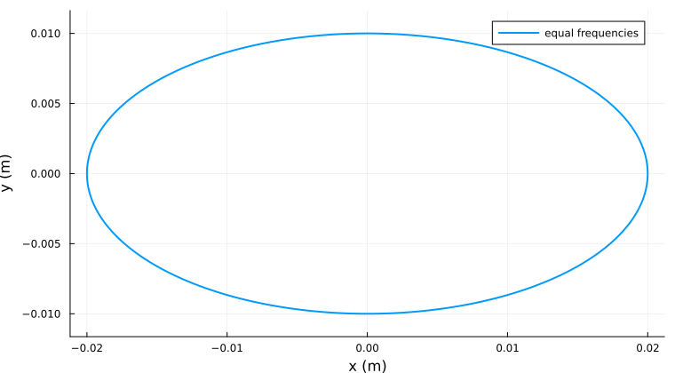
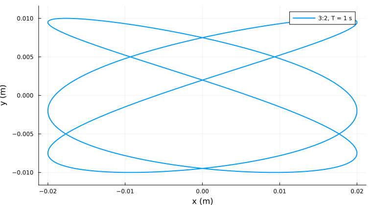
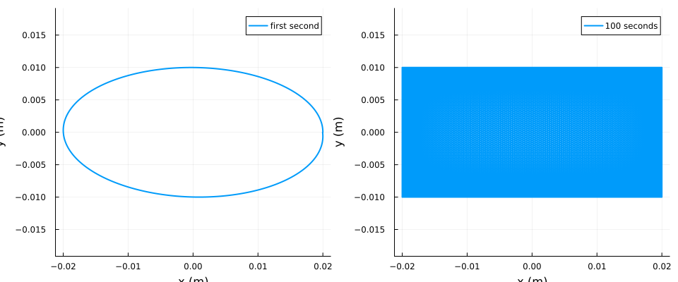
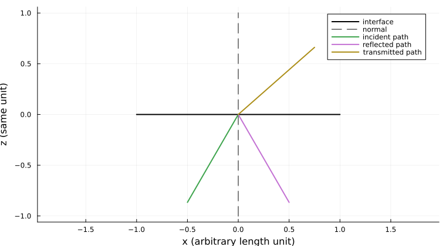
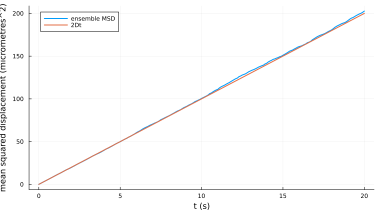

# הרחבות ללימוד עצמי — שבועות 1–3

פיזיקה עם Julia ללימוד עצמי, כהרחבה לבחירה. נתחיל ב[מפתח ובהוראות ההתקנה](README.md). תשובות מנומקות נמצאות ב[קובץ הפתרונות](solutions-he.md). הקוד משותף למחברות, וכל הפלטים להלן התקבלו בהרצה ממשית.

- [1. עקומות ליסז׳ו: לראות תדירות ומופע](#week01-lissajous)
- [2. החזרה פנימית מלאה: מהחלטה על קרן לשדה גלי](#week02-total-internal-reflection)
- [3. הילוכים אקראיים: כיצד אקראיות יוצרת חוק דיפוזיה](#week03-diffusion)

<a id="week01-lissajous"></a>

# 1. עקומות ליסז׳ו: לראות תדירות ומופע

**הרחבה לבחירה · כ־90–120 דקות כולל הניסויים.** החומר אינו נבחן, אינו תנאי להמשך ואינו מטלת בונוס לצבירת נקודות. הוא נפרד מהבונוס של שבוע 1. נניח היכרות עם חשבון והשמה למשתנים; את פעולות הווקטורים והשרטוט הנוספות נסביר כאן ככלים נתונים. אין צורך להגדיר פונקציות.

## 1.1 השאלה הפיזיקלית

נדמיין מסה קטנה המחוברת לקפיצים בשני כיוונים ניצבים, ונצפה בה מלמעלה. כל קואורדינטה יכולה להתנודד באופן סינוסואידלי, ובכל זאת המסלול המשולב עשוי להיות אליפסה, קו ישר או תבנית מחזורית מורכבת. כיצד תמונה דו־ממדית מלמדת אותנו על שני שעונים?

אותה מתמטיקה מתארת את ההסטה האופקית והאנכית של אוסצילוסקופ במצב XY. שם הקואורדינטות מייצגות מתחים ולא אורכים. לגרף של אות אחד כנגד האחר יש פרמטר זמן משותף, אף שהזמן אינו ציר בגרף. נבחין בין **עקומה פרמטרית** זו לבין שני גרפים של מקום כתלות בזמן.

> **פיזיקה — שני כוחות מחזירים בלתי תלויים.** נבחר את הכיוון ימינה כחיובי בציר $x$ ואת הכיוון למעלה כחיובי בציר $y$. למסה $m$ בק״ג פועלים $F_x=-k_xx$ ו־$F_y=-k_yy$, כאשר $k_x,k_y>0$ הם קבועי קפיץ ביחידות N/m. בהנחת העתקות קטנות, קפיצים ליניאריים, חיכוך זניח וללא צימוד בין הכיוונים מתקבלות המשוואות $m\ddot{x}=-k_xx$ ו־$m\ddot{y}=-k_yy$. סימן המינוס הופך את הכוח למחַזיר. הראשית היא שיווי המשקל; אין זה בדרך כלל מסלול כבידתי. כשההעתק בכיוון מסוים אפס, הכוח באותו כיוון אפס. העתקות גדולות, חיכוך, אילוץ חיצוני או צימוד מחייבים מודל אחר.

הנגזרת השנייה של קוסינוס היא מינוס אותה פונקציה כפול ריבוע התדירות הזוויתית. הצבה במשוואת התנועה נותנת $\omega_x=\sqrt{k_x/m}$. נבחר את ראשית הזמן כך שלתנודת $y$ יהיה מופע סינוס אפס:

$$x(t)=A\cos(\omega_xt+\delta),\qquad y(t)=B\sin(\omega_yt).$$

$A,B$ הן משרעות חיוביות במטרים, $t$ בשניות, $\omega_x,\omega_y$ תדירויות זוויתיות חיוביות ב־rad/s, ו־$\delta$ ברדיאנים. מחזור שלם הוא $2\pi$ רדיאנים. התדירות הרגילה היא $f=\omega/(2\pi)$ בהרץ וזמן המחזור $T=1/f$. נתחיל ב־$A=0.02$ מ׳ וב־$B=0.01$ מ׳. הגדלת אחת המשרעות אמורה למתוח את התמונה בלי לשנות את התזמון.

> **מתמטיקה — מופע הוא מיקום בתוך מחזור.** הוספת $2\pi$ למופע אינה משנה את הערך הנצפה. במוסכמת הקוסינוס והסינוס שלנו, $\delta=0$ **אינו** אומר ששתי הקואורדינטות באותו מופע: הקוסינוס כבר מקדים את הסינוס ברבע מחזור. לפני פירוש סימן המופע, נכתוב את ההגדרות המדויקות.

## 1.2 מרגע יחיד לתנועה שלמה

נטען את חבילת השרטוט שכבר הותקנה. `using` מאפשר שימוש בכליה, `gr()` בוחר מנוע גרפי ו־`default` קובע הגדרות תצוגה. `Printf` מאפשר פלט מעוצב: `%.2f` מציג שתי ספרות אחרי הנקודה בלי לעגל את המשתנה בזיכרון. הגדרות אלו משפיעות על התצוגה, לא על הפיזיקה.

```julia
using Plots
using Printf
gr()
default(size = (760, 420), linewidth = 2, legend = :topright)
println("Plots ready; coordinates in metres, time in seconds.")
```

```{.output}
Plots ready; coordinates in metres, time in seconds.
```

לפני ההרצה נחשב בראש: אחרי רבע שנייה בתדירות של הרץ אחד, הקוסינוס אפס והסינוס אחד. לכן נצפה ל־$x=0$ ול־$y=B$.

```julia
A = 0.02
B = 0.01
omega_x = 2pi
omega_y = 2pi
delta = 0.0
t = 0.25
x = A * cos(omega_x * t + delta)
y = B * sin(omega_y * t)
@printf("t = %.2f s: x = %.5f m, y = %.5f m\n", t, x, y)
```

```{.output}
t = 0.25 s: x = 0.00000 m, y = 0.01000 m
```

האפס המודפס מעוגל. בחישוב נקודה צפה הקוסינוס עשוי להיות בערך $6\times10^{-17}$ ולא אפס מדויק. זהו דיוק חישובי סופי של זהות מתמטית, ולא העתק פיזיקלי מדיד.

> **Julia — מילון שרטוט קצר.** הביטוי `range(0.0, 1.0; length = 501)` נותן 501 זמנים במרווחים שווים, כולל הקצוות. `length` סופר אותם ו־`step` מחזיר את המרווח. וקטור מכיל ערך לכל זמן. הנקודות ב־`cos.(...)`, ב־`.*` וב־`.+` אומרות להפעיל את הפעולה על כל איבר בנפרד. למשל ריבוע איברי הווקטור 2, 3 נותן 4, 9, ולא מכפלת מטריצות. `plot(times, xs)` מצמיד זמן ומיקום בעלי אותו אינדקס. `plot!` מוסיף סדרה לאיור קיים. `display` מציג איור במפורש, גם בהרצה כקובץ תוכנית.

```julia
times = range(0.0, 1.0; length = 501)
xs = A .* cos.(omega_x .* times .+ delta)
ys = B .* sin.(omega_y .* times)
@printf("%d samples; dt = %.4f s\n", length(times), step(times))
p_time = plot(times, xs; label = "x(t)", xlabel = "t (s)", ylabel = "position (m)")
plot!(p_time, times, ys; label = "y(t)")
display(p_time)
p_orbit = plot(xs, ys; label = "equal frequencies", xlabel = "x (m)",
    ylabel = "y (m)", aspect_ratio = :equal)
display(p_orbit)
```

```{.output}
501 samples; dt = 0.0020 s
```




באיור הראשון רואים את שני השעונים. בשני הזמן הוסר מן הצירים, ואנו עוקבים אחרי זוג הקואורדינטות. יחס צירים שווה חשוב: למטר אופקי ולמטר אנכי אותו אורך חזותי. כאשר $A\ne B$ נקבל אליפסה ולא מעגל. הקווים מחברים דגימות של מודל אנליטי; אלו אינן מדידות חדשות או תוצאות של פותר משוואות דיפרנציאליות.

## 1.3 גזירת האליפסה בתדירויות שוות

נסמן $u=\omega t$, $X=x/A$ ו־$Y=y/B$. נוסחת חיבור הזוויות נותנת

$$X=\cos u\cos\delta-\sin u\sin\delta,
\qquad X+Y\sin\delta=\cos u\cos\delta.$$

נעלה בריבוע ונשתמש ב־$\cos^2u=1-Y^2$:

$$\boxed{X^2+Y^2+2XY\sin\delta=\cos^2\delta.}$$

עבור $\delta=0$ נקבל $X^2+Y^2=1$. עבור $\delta=\pi/2$ נקבל $(X+Y)^2=0$, כלומר את הישר $X=-Y$. ב־$\delta=-\pi/2$ השיפוע חיובי. במופעי ביניים נקבל אליפסה נטויה. אלה תוצאות גאומטריות של המופע, ולא עדות לאובדן אנרגיה.

ננבא את שתי הצורות באיור הבא. השארית היא צד שמאל פחות צד ימין של המשוואה במסגרת, בכל נקודת דגימה. `abs.` לוקח ערכים מוחלטים ו־`maximum` מוצא את הגדול שבהם; גם העלאה בחזקה עם נקודה פועלת איבר־איבר. שארית זעירה בודקת יחד את הגזירה ואת הקוד.

```julia
delta = pi / 4
xs = A .* cos.(omega_x .* times .+ delta)
ys = B .* sin.(omega_y .* times)
X = xs ./ A
Y = ys ./ B
ellipse_residual = X .^ 2 .+ Y .^ 2 .+ 2 .* X .* Y .* sin(delta) .- cos(delta)^2
@printf("Largest ellipse-equation residual: %.2e\n", maximum(abs.(ellipse_residual)))
p_phase = plot(xs, ys; label = "delta = pi/4", xlabel = "x (m)",
    ylabel = "y (m)", aspect_ratio = :equal)
plot!(p_phase, A .* cos.(omega_x .* times .+ pi / 2), ys; label = "delta = pi/2")
display(p_phase)
```

```{.output}
Largest ellipse-equation residual: 6.66e-16
```


הישר והאליפסה הנטויה תואמים את הגזירה. הספרות האחרונות של השארית עשויות להשתנות בין ספריות חישוב, אך סדר הגודל צריך להיות קרוב לדיוק המכונה. את הישר עוברים הלוך ושוב: צורת המסלול לבדה אינה מציגה את כיוון התנועה או את המהירות.

## 1.4 מדוע תבניות מסוימות נסגרות?

כדי ש**המצב המלא** יחזור, גם המקומות וגם המהירויות צריכים לחזור. עבור משרעות שאינן אפס ותדירויות חיוביות, התנאי הוא התקדמות של שני המופעים במספר שלם של מחזורים:

$$\omega_xT=2\pi p,\qquad \omega_yT=2\pi q,$$

כאשר $p,q$ שלמים חיוביים. מחלוקה נובע שהיחס $\omega_x/\omega_y=p/q$ רציונלי. אם אין ל־$p,q$ גורם משותף ו־$\omega_x=p\Omega$, $\omega_y=q\Omega$, זמן המחזור הבסיסי של המצב הוא $2\pi/\Omega$.

למשל, $f_x=3$ הרץ ו־$f_y=2$ הרץ נותנים חזרה לאחר שנייה אחת. מגזירה נקבל

$$v_x=-A\omega_x\sin(\omega_xt+\delta),\qquad
v_y=B\omega_y\cos(\omega_yt).$$

נשווה את קצות חלון הזמן. `xs[1]` הוא האיבר הראשון ו־`xs[end]` האחרון. `hypot(dx,dy)` מחשב $\sqrt{dx^2+dy^2}$. הסכמה במיקום בלבד יכולה לציין גם חצייה מקרית של המסלול.

```julia
omega_x = 3 * 2pi
omega_y = 2 * 2pi
delta = 0.3
times = range(0.0, 1.0; length = 1501)
xs = A .* cos.(omega_x .* times .+ delta)
ys = B .* sin.(omega_y .* times)
vx = -A .* omega_x .* sin.(omega_x .* times .+ delta)
vy = B .* omega_y .* cos.(omega_y .* times)
@printf("Position closure error: %.2e m\n", hypot(xs[end] - xs[1], ys[end] - ys[1]))
@printf("Velocity closure error: %.2e m/s\n", hypot(vx[end] - vx[1], vy[end] - vy[1]))
display(plot(xs, ys; label = "3:2, T = 1 s", xlabel = "x (m)",
    ylabel = "y (m)", aspect_ratio = :equal))
```

```{.output}
Position closure error: 2.14e-17 m
Velocity closure error: 1.28e-15 m/s
```



ההפרשים הקטנים הן במקום והן במהירות תומכים בזמן המחזור שחזינו. בחצייה בתוך העקומה המהירויות בשני המעברים בדרך כלל שונות; זו אינה חזרה של כל המצב הפיזיקלי.

> **בדיקה — סגירה אינה תהודה.** תיארנו תנודות חופשיות ללא כוח מאלץ מחזורי. יחס תדירויות רציונלי גורם לתמונה לחזור, אך אינו כשלעצמו מעיד על קליטת אנרגיה בתהודה. לתיאור תנודה מאולצת צריך להוסיף כוח חיצוני ובדרך כלל גם ריסון.

## 1.5 שעונים כמעט שווים וסגירה מדומה

נבחר תדירויות 1.01 הרץ ו־1 הרץ. המופע היחסי משתנה בקצב $\Delta\omega=0.01(2\pi)$ rad/s, ולכן משלים מחזור בזמן

$$T_{\rm relative}=\frac{2\pi}{|\Delta\omega|}=100\ \mathrm{s}.$$

בשנייה אחת נראה כמעט אליפסה. במשך מאה שניות מצטיירים גדילים רבים. ובכל זאת 1.01 הוא המספר הרציונלי 101/100 במודל המתמטי, ולכן הדוגמה נסגרת לבסוף. `layout = (1, 2)` מציג שורה אחת ושתי עמודות של איורים.

```julia
omega_x = 1.01 * 2pi
omega_y = 2pi
delta = 0.0
short_t = range(0.0, 1.0; length = 1001)
long_t = range(0.0, 100.0; length = 100001)
@printf("Relative-phase cycle: %.1f s\n", 2pi / abs(omega_x - omega_y))
p_short = plot(A .* cos.(omega_x .* short_t), B .* sin.(omega_y .* short_t);
    label = "first second", xlabel = "x (m)", ylabel = "y (m)", aspect_ratio = :equal)
p_long = plot(A .* cos.(omega_x .* long_t), B .* sin.(omega_y .* long_t);
    label = "100 seconds", xlabel = "x (m)", ylabel = "y (m)", aspect_ratio = :equal)
display(plot(p_short, p_long; layout = (1, 2), size = (960, 400)))
```

```{.output}
Relative-phase cycle: 100.0 s
```



ליחס תדירויות אי־רציונלי מדויק אין זמן חזרה סופי של המצב. בתנועה אידיאלית כזאת הנקודות צפופות במלבן המותר לאורך זמן ארוך כרצוננו, אף שכל קטע סופי הוא רק עקומה. ציור צפוף ותדירויות עשרוניות בדיוק סופי אינם הוכחה לאי־רציונליות. גם תדירויות מדודות אינן ידועות בדיוק מוחלט. אפשר לדווח על חזרה בטווח סבילות ובחלון זמן מוגדרים; ניסוי סופי אינו מוכיח טענה על זמן אינסופי.

## 1.6 האם השרטוט יכול להמציא צורה?

המחשב מחבר נקודות בקווים ישרים. ארבעה מרווחים סביב אליפסה יוצרים מצולע דמוי מעוין. משוואת התנועה לא השתנתה; רק הייצוג השתנה.

```julia
coarse_t = range(0.0, 1.0; length = 5)
fine_t = range(0.0, 1.0; length = 1001)
p_alias = plot(A .* cos.(2pi .* fine_t), B .* sin.(2pi .* fine_t);
    label = "dense model", xlabel = "x (m)", ylabel = "y (m)", aspect_ratio = :equal)
plot!(p_alias, A .* cos.(2pi .* coarse_t), B .* sin.(2pi .* coarse_t);
    marker = :circle, label = "4 intervals")
display(p_alias)
```


> **בדיקה — דגימה וקיפול תדרים.** כדי למנוע את עמימות הדגימה הפשוטה של סינוס, תדירות הדגימה צריכה להיות גדולה מפעמיים תדירותו. תנאי זה לבדו אינו מבטיח איור חלק ומועיל. נתחיל בלפחות 50–100 דגימות למחזור המהיר ביותר ואז נחצה את מרווח הזמן. שינוי גדול בגאומטריה מעיד שהדגימה הקודמת לא הספיקה. דגימה פעם אחת בכל מחזור יכולה אף להציג תנועה כאילו היא קפואה.

## 1.7 אנרגיה כבדיקה פיזיקלית נוספת

האנרגיה הפוטנציאלית היא $U=\tfrac12 k_xx^2+\tfrac12 k_yy^2$. יחד עם האנרגיה הקינטית נקבל

$$E=\frac m2(v_x^2+v_y^2)+\frac m2(\omega_x^2x^2+\omega_y^2y^2)
=\frac m2(\omega_x^2A^2+\omega_y^2B^2).$$

השוויון נובע בנפרד בכל כיוון מן הזהות $\sin^2+\cos^2=1$. האנרגיה קבועה גם במסלול מורכב או שאינו נסגר. בבדיקות הנתונות `@test` מציין תנאי שאמור להתקיים, `isapprox` בודק הסכמה עד סבילות מוחלטת ו־`@testset` מקבץ את התוצאות. הבדיקות משתמשות בווקטורי דוגמת 3:2 שנשמרו קודם; שינוי התדירויות המאוחר לא שינה אותם.

```julia
using Test
# The final semicolon hides the returned test object; its summary still prints.
@testset "Oscillator geometry" begin
    @test isapprox(x, 0.0; atol = 1e-16)
    @test isapprox(y, B; atol = 1e-16)
    @test maximum(abs.(ellipse_residual)) < 1e-12
    @test hypot(xs[end] - xs[1], ys[end] - ys[1]) < 1e-12
    @test hypot(vx[end] - vx[1], vy[end] - vy[1]) < 1e-12
    m = 0.1
    energy = 0.5 .* m .* (vx .^ 2 .+ vy .^ 2) .+
        0.5 .* m .* ((3 * 2pi)^2 .* xs .^ 2 .+ (2 * 2pi)^2 .* ys .^ 2)
    expected_energy = 0.5 * m * ((3 * 2pi)^2 * A^2 + (2 * 2pi)^2 * B^2)
    @test maximum(abs.(energy .- expected_energy)) < 1e-12
end;
```

```{.output}
Test Summary:       | Pass  Total  Time
Oscillator geometry |    6      6  0.2s
```

הצלחה בודקת התאמה למודל האידיאלי, לא את נכונותו עבור קפיץ ממשי. דעיכת משרעת מדודה תציע להוסיף ריסון; תלות של התדירות במשרעת תציע כוח מחזיר לא ליניארי.

## 1.8 חקירה מודרכת ובדיקה עצמית

1. **ננבא ואז נשרטט:** בתדירויות שוות נשווה $\delta=0,\pi/4,\pi/2,-\pi/2$. נרשום את הצורה ואת המקום בזמן אפס, ונסביר את סימני שיפועי הישרים מהמשוואות.
2. **טבלת מחזורים:** ליחסים 1:1, 2:1 ו־3:2 נבחר $f_y=1$ הרץ, נחשב את החזרה הראשונה של המצב ונבדוק מקום ומהירות. נוסיף יחידות ולפחות מאה דגימות למחזור המהיר ביותר.
3. **שינוי פיזיקלי יחיד:** נכפיל רק את $A$. ננבא את השינוי ברוחב, בגובה, בזמן המחזור ובאנרגיית תנודת $x$. נשאיר את $B$ והתדירויות קבועים.
4. **אבחון איור:** נשרטט תנועה ביחס 3:2 במשך שתי שניות במרווחי דגימה של 0.5 ושל 0.002 שניות. נסביר מדוע הסכמה בקצוות יכולה להתקיים לצד מצולע מטעה.
5. **המשך פתוח:** נשווה יחס תדירויות $\sqrt2$ ל־1.414 במשך 10 ובמשך 100 שניות. ננסח מסקנה המבחינה בין המודל המדויק לבין הראיות המספריות.

**תוצר ללמידה עצמית:** שני איורים מנוגדים, טבלת תדירות וזמן מחזור, בדיקת יחידות או אנרגיה ופסקה המבחינה בין השפעה פיזיקלית להשפעת דגימה. פתרונות מוצעים נמצאים בקובץ הפתרונות הנפרד; נקרא אותם לאחר הניבוי.

**סיכום.** למדנו תנועה פרמטרית, תדירות זוויתית, מופע, גזירת אליפסה, סגירה ביחסים רציונליים, הפרש תדירויות ועמימות דגימה. תמונה אמינה זקוקה למודל, לצירים מסומנים, לחלון זמן ולבדיקות שאינן רק חזותיות.

**לקריאה נוספת:** [תנועה הרמונית פשוטה, OpenStax](https://openstax.org/books/university-physics-volume-1/pages/15-1-simple-harmonic-motion); [פעולות מתמטיות ב־Julia](https://docs.julialang.org/en/v1/manual/mathematical-operations/). ההסברים כאן מספיקים לביצוע החקירה.

<a id="week02-total-internal-reflection"></a>

# 2. החזרה פנימית מלאה: מהחלטה על קרן לשדה גלי

**הרחבה לבחירה · כ־100–140 דקות.** החומר אינו נבחן, אינו תנאי להמשך ונפרד מבונוס הפאזורים המרוכבים. נניח חשבון במשתנים, טריגונומטריה במעלות ותנאי `if`. את פעולות הדגימה והשרטוט נסביר כאן. וקטור גל, דעיכה אוונסנטית ומפתח נומרי הם מושגי ההרחבה החדשים.

## 2.1 האם אור יכול להגיע לגבול ולהישאר בפנים?

פני המים בבריכה עשויים להיראות כמראה למתבונן מלמטה בזווית מתאימה. סיבים אופטיים מנצלים תופעה קרובה להולכת אור. אי־שוויון פשוט מסווג קרן, אבל הפיזיקה המעניינת היא מקורו ומה קורה לשדה האלקטרומגנטי בצד האחר.

> **פיזיקה — מודל הממשק.** שני תווכים אחידים, איזוטרופיים, שקופים ולא מגנטיים נפגשים במישור. מקדמי השבירה הממשיים והחיוביים שלהם הם $n_1,n_2$, ומהירויות המופע $c/n_1,c/n_2$. האור בעל תדירות יחידה, המשטח חלק בקנה המידה של אורך הגל וכל תווך ממלא תחילה חצי־מרחב אינסופי. זוויות הפגיעה $\theta_i$ והשבירה $\theta_t$ נמדדות מהנורמל, בין אפס ל־$90^\circ$. התווך הפוגע נמצא ב־$z<0$ והשני ב־$z>0$. בליעה, חספוס וממשק נוסף קרוב מחייבים מודל עשיר יותר. בפגיעה ניצבת הקרן נשארת ניצבת.

## 2.2 גזירת חוק סנל מהתאמת מופע

מופע של גל מישורי הוא $\mathbf{k}\cdot\mathbf{r}-\omega t$. וקטור הגל $\mathbf{k}$ מצביע בכיוון ההתקדמות וגודלו $k=n\omega/c$; הוא מתאר את קצב שינוי המופע במרחב. שיא גל נע כך שהמופע שלו קבוע.

תנאי השפה החשמליים והמגנטיים צריכים להתקיים בכל נקודה בממשק ובכל זמן. לכן לגל הפוגע, לגל המוחזר ולגל העובר יש אותה תדירות ואותו רכיב של וקטור הגל במקביל לממשק. אחרת המופע היחסי ישתנה לאורך המשטח והתאמה בנקודה אחת לא תישמר באחרת. מכאן

$$k_1\sin\theta_i=k_2\sin\theta_t,
\qquad\boxed{n_1\sin\theta_i=n_2\sin\theta_t.}$$

הגל המוחזר נשאר בתווך 1 והופך את הרכיב הניצב של וקטור הגל, ולכן זווית ההחזרה שווה לזווית הפגיעה. חוק סנל קובע כיוון, לא את חלק ההספק המוחזר או העובר; לשם כך נחוצים תנאי השפה למשרעות, הנותנים את מקדמי פרנל.

> **מתמטיקה — מתי קיימת זווית ממשית?** עבור $0\leq\theta_i<90^\circ$ נגדיר $q=(n_1/n_2)\sin\theta_i$. קרן עוברת מתקדמת דורשת $q\leq1$. אם $n_1>n_2$, הגבול הוא $\theta_c=\arcsin(n_2/n_1)$. מעליו מתקבלת החזרה פנימית מלאה (TIR); בשוויון הכיוון העובר משיק לממשק. אם $n_1\leq n_2$, אין פגיעה בזווית קטנה מ־$90^\circ$ הנותנת TIR במודל זה.

## 2.3 תרגום החוק להחלטה ב־Julia

ההכנה בוחרת את המנוע הגרפי המותקן ופלט מספרי מעוצב. `%.3f` מציג שלוש ספרות אחרי הנקודה. `println` מדפיס בכוונה; מחברת מציגה גם את הערך האחרון בתא באופן אוטומטי.

```julia
using Plots
using Printf
gr()
default(size = (760, 420), linewidth = 2, legend = :topright)
println("Optics ready; angles measured from the interface normal unless stated.")
```

```{.output}
Optics ready; angles measured from the interface normal unless stated.
```

לזכוכית $n_1=1.50$ ולאוויר $n_2=1.00$. ננבא אם פגיעה ב־$50^\circ$ מאפשרת זווית שבירה ממשית. `sind` מקבל מעלות ו־`asind` מחזיר מעלות. נחשב תחילה את $q$ ונבחר ענף לפני הפעלת סינוס הפוך.

```julia
n1 = 1.50
n2 = 1.00
theta_i_deg = 50.0
q = n1 * sind(theta_i_deg) / n2
@printf("sin(theta_t) requested by Snell: %.6f\n", q)
if q > 1.0
    println("total internal reflection: no propagating transmitted ray")
elseif q == 1.0
    println("critical angle: transmitted ray is grazing")
else
    theta_t_deg = asind(q)
    @printf("refracted ray: theta_t = %.3f degrees\n", theta_t_deg)
end
theta_c_deg = asind(n2 / n1)
@printf("critical angle = %.3f degrees\n", theta_c_deg)
```

```{.output}
sin(theta_t) requested by Snell: 1.149067
total internal reflection: no propagating transmitted ray
critical angle = 41.810 degrees
```

הזווית הקריטית היא כ־$41.81^\circ$, פחות מזווית הפגיעה. שגיאת תחום בסינוס ההפוך הייתה מצביעה על בחירת הענף הפיזיקלי הלא נכון. אין ״לתקן״ זאת באמצעות החלפת כל $q>1$ באחד.

> **בדיקה — לגבול מספרי יש אי־ודאות פיזיקלית.** הענף `q == 1.0` מציין את הגבול המתמטי האידיאלי. חישוב טריגונומטרי עשוי לתת ערך מעט מעליו או מתחתיו בגלל עיגול. במדידה קרובה לסף נביא בחשבון אי־ודאות בזווית ובמקדמי השבירה, ונציין ״קרוב לקריטי״ אם התחום חוצה את האחד. עיגול מוקדם או סבילות רחבה עלולים להזיז סף פיזיקלי ממשי.

נקטין את הפגיעה ל־$30^\circ$. נצפה לזווית שבירה גדולה יותר, כי מקדם השבירה בתווך השני נמוך יותר. האיור הבא מתאר **מסלולים**, לא חלקי הספק: לאורך המסלול הפוגע נעים אל הראשית, ולאורך השניים האחרים מתרחקים ממנה.

> **Julia — שרטוט מסלולים מדוגמים.** `range` יוצר ערכים במרווחים שווים לפרמטר מרחק. `.*` מכפיל כל איבר; סוגריים מרובעים מאפשרים לתת קואורדינטות קצה מפורשות. `plot` יוצר איור ו־`plot!` מוסיף קווים. `aspect_ratio = :equal` מציג מרחקים שווים באותו אורך חזותי. התוויות והצבעים מבחינים בין שלושת המסלולים.

```julia
theta_i_deg = 30.0
theta_t_deg = asind(n1 * sind(theta_i_deg) / n2)
@printf("30-degree incidence gives %.3f-degree transmission\n", theta_t_deg)
s = range(0.0, 1.0; length = 100)
p_rays = plot([-1.0, 1.0], [0.0, 0.0]; color = :black, label = "interface",
    xlabel = "x (arbitrary length unit)", ylabel = "z (same unit)", aspect_ratio = :equal)
plot!(p_rays, [0.0, 0.0], [-1.0, 1.0]; linestyle = :dash, color = :gray, label = "normal")
plot!(p_rays, -s .* sind(theta_i_deg), -s .* cosd(theta_i_deg); label = "incident path")
plot!(p_rays, s .* sind(theta_i_deg), -s .* cosd(theta_i_deg); label = "reflected path")
plot!(p_rays, s .* sind(theta_t_deg), s .* cosd(theta_t_deg); label = "transmitted path")
display(p_rays)
```

```{.output}
30-degree incidence gives 48.590-degree transmission
```



הקרן נשברת הרחק מהנורמל, כצפוי. גם מתחת לזווית הקריטית יש בדרך כלל החזרה חלקית. השרטוט אינו מחשב את חלקה ולכן אינו קובע את יעילות ההעברה.

## 2.4 מעבר לתמונת הקרניים: שדה אוונסנטי

״אין קרן עוברת״ אינו אומר ״אין שדה בתווך 2״. הרכיב המקביל של וקטור הגל נקבע מהגל הפוגע, ואילו גודלו בתווך 2 מקיים

$$k_{2z}^2+k_\parallel^2=\left(\frac{n_2\omega}{c}\right)^2.$$

נציב ונקבל

$$k_{2z}^2=\left(\frac\omega c\right)^2
\left(n_2^2-n_1^2\sin^2\theta_i\right).$$

מעל הזווית הקריטית אגף ימין שלילי. נכתוב $k_{2z}=i\kappa$, כאשר $i^2=-1$ ו־

$$\kappa=\frac{2\pi}{\lambda_0}\sqrt{n_1^2\sin^2\theta_i-n_2^2},
\qquad\lambda_0=\frac{2\pi c}{\omega}.$$

הכתיב המרוכב הוא כלי חישובי: השדה הפיזיקלי הוא החלק הממשי. במוסכמת הזמן $e^{-i\omega t}$, רכיב מייצג של השדה העובר הוא

$$E(x,z,t)=\operatorname{Re}\left[E_0e^{ik_\parallel x-i\omega t}e^{-\kappa z}\right].$$

נבחר את הפתרון הדועך; שדה הגדל ללא גבול כאשר $z\to\infty$ אינו מתאים לבעיית ההארה הזאת. המשרעת יורדת פי $e$ בעומק החדירה $d=1/\kappa$. ריבוע המשרעת יורד פי $e$ כבר בעומק $d/2$.

> **פיזיקה — דעיכה אינה בליעה.** לשדה אוונסנטי בחצי־מרחב חסר הפסדים אין שטף אנרגיה ממוצע בזמן בכיוון הניצב לממשק, אף שהשדה אינו אפס. ריבוע המשרעת אינו הספק מועבר בניצב במצב זה. שימור האנרגיה נותן החזרה מלאה בממשק האידיאלי. תווך נוסף בעל מקדם שבירה גבוה, המוצב במרחק דומה לאורך הדעיכה, יכול לאפשר העברת הספק דרך המרווח: החזרה פנימית מלאה מתוסכלת. אז הנחת חצי־המרחב האינסופי אינה תקפה.

נבחר אורך גל בריק $\lambda_0=0.55\ \mu$m. כאשר האורכים במיקרומטרים, $\kappa$ מתקבל במיקרומטר הפוך. `sqrt.` ו־`exp.` פועלים איבר־איבר. ציר עומק לוגריתמי מבליט את השינוי החד סמוך לסף. נתחיל מעט מעל הזווית הקריטית, כי בסף עצמו קבוע הדעיכה מתאפס.

```julia
lambda0_um = 0.55
θ_deg = range(theta_c_deg + 0.01, 80.0; length = 1000)
kappa_per_um = (2pi / lambda0_um) .* sqrt.(n1^2 .* sind.(θ_deg) .^ 2 .- n2^2)
depth_um = 1.0 ./ kappa_per_um
kappa50 = (2pi / lambda0_um) * sqrt(n1^2 * sind(50.0)^2 - n2^2)
@printf("50 degrees: amplitude penetration depth = %.4f micrometres\n", 1 / kappa50)
z_um = range(0.0, 1.0; length = 501)
p_depth = plot(θ_deg, depth_um; label = "1/kappa", xlabel = "incidence (degrees)",
    ylabel = "amplitude depth (micrometres)", yscale = :log10)
p_field = plot(z_um, exp.(-kappa50 .* z_um); label = "field amplitude",
    xlabel = "distance into air (micrometres)", ylabel = "normalized value")
plot!(p_field, z_um, exp.(-2 .* kappa50 .* z_um); label = "squared amplitude")
display(plot(p_depth, p_field; layout = (1, 2), size = (960, 420)))
```

```{.output}
50 degrees: amplitude penetration depth = 0.1547 micrometres
```


ב־$50^\circ$ עומק החדירה הוא חלק קטן ממיקרומטר. בהתקרבות לסף מלמעלה מתקבלים $\kappa\to0$ ו־$d\to\infty$ במודל הגל המישורי. אלומה או גאומטריה סופית אינן חייבות לממש עומק גדול כרצוננו. הגדלת הזווית מגדילה את $\kappa$ ומחזקת את הכליאה.

## 2.5 מממשק מישורי לסיב אידיאלי

נבחן ליבה ישרה בעלת מקדם $n_{\rm core}$, עטופה במעטפת עם $n_{\rm clad}<n_{\rm core}$. קרן הנמצאת במישור המכיל את הציר נקראת מרידיונלית. נסמן ב־$\alpha$ את זוויתה לציר. זווית הפגיעה בדופן הישרה היא $90^\circ-|\alpha|$, ולכן TIR דורשת

$$|\alpha|<\alpha_{\max}=\arccos(n_{\rm clad}/n_{\rm core}).$$

בפאת הכניסה השטוחה הנורמל מקביל לציר הסיב. מתווך חיצוני בעל מקדם $n_0$, חוק סנל נותן $n_0\sin\theta_0=n_{\rm core}\sin\alpha$. בגבול הזווית הפנימית נקבל

$$n_0\sin\theta_{0,\max}=\sqrt{n_{\rm core}^2-n_{\rm clad}^2}\equiv\mathrm{NA}.$$

הגודל חסר היחידות NA נקרא **מפתח נומרי**. אם $\mathrm{NA}/n_0>1$, הגבול הזוויתי רווי ב־$90^\circ$; אין להפעיל סינוס הפוך מחוץ לתחומו. בניגוד לחיתוך שגוי של זווית שבירה בלתי אפשרית, `min` כאן מבטא במפורש את גבול הכיוונים החיצוניים הזמינים.

```julia
n_core = 1.48
n_clad = 1.46
n_external = 1.0
NA = sqrt(n_core^2 - n_clad^2)
alpha_max_deg = acosd(n_clad / n_core)
theta_accept_deg = asind(min(1.0, NA / n_external))
@printf("NA = %.4f; internal axial limit = %.3f degrees\n", NA, alpha_max_deg)
@printf("External acceptance half-angle = %.3f degrees\n", theta_accept_deg)
alpha_deg = 5.0
theta_wall_deg = 90.0 - alpha_deg
@printf("Chosen axial angle = %.1f; wall incidence = %.1f degrees\n", alpha_deg, theta_wall_deg)
println("Guided by strict TIR? ", theta_wall_deg > asind(n_clad / n_core))
```

```{.output}
NA = 0.2425; internal axial limit = 9.430 degrees
External acceptance half-angle = 14.033 degrees
Chosen axial angle = 5.0; wall incidence = 85.0 degrees
Guided by strict TIR? true
```

חרוט הקבלה צר כאשר הפרש מקדמי השבירה קטן. זווית פנימית של $5^\circ$ לציר מאפשרת הנחיה עבור הערכים הנתונים. נבחין בין זווית זו, זווית הפגיעה בדופן וזווית הכניסה החיצונית.

## 2.6 מעקב אחרי החזרות רבות

נבחר רוחב רוחבי $w=0.1$ מ״מ ונשגר מהמרכז $y=0$ בזמן הכניסה $x=0$. בין פגיעות בדופן מתקיים $dy/dx=\tan\alpha$. עבור $\alpha>0$, הפגיעה הראשונה מתרחשת ב־$x=w/(2\tan\alpha)$, ובהמשך המרחק הצירי בין פגיעות הוא $w/\tan\alpha$. ההחזרה הופכת את הכיוון הרוחבי ומשמרת את הכיוון הצירי.

ישר ״פרוש״ $u=x\tan\alpha$ עובר בהעתקי מראה של הליבה. קיפולו חזרה נותן גל משולש:

$$y(x)=\frac w2-\left|\left[(u+w/2)\bmod(2w)\right]-w\right|.$$

$a\bmod b$ היא השארית בתחום $[0,b)$ כאשר $b>0$. בקטע הראשון $0\leq u\leq w/2$ ההצבה נותנת $y=u$, ובקטע הבא השיפוע מתהפך. ב־Julia, `mod.` פועל על כל קואורדינטה ו־`abs.` מבצע את הקיפול. אין צורך בלולאה או בשגרת החזרה נסתרת.

```julia
width_mm = 0.1
length_mm = 5.0
x_mm = range(0.0, length_mm; length = 5001)
unfolded_mm = x_mm .* tand(alpha_deg)
y_mm = width_mm / 2 .- abs.(mod.(unfolded_mm .+ width_mm / 2, 2 * width_mm) .- width_mm)
@printf("First wall hit: %.4f mm\n", width_mm / (2 * tand(alpha_deg)))
@printf("Axial distance between later wall hits: %.4f mm\n", width_mm / tand(alpha_deg))
p_fiber = plot(x_mm, y_mm; label = "ideal meridional ray", xlabel = "axial x (mm)",
    ylabel = "transverse y (mm)", ylim = (-0.07, 0.07))
hline!(p_fiber, [-width_mm / 2, width_mm / 2]; color = :black, label = "core boundaries")
display(p_fiber)
```

```{.output}
First wall hit: 0.5715 mm
Axial distance between later wall hits: 1.1430 mm
```


קנה המידה הרוחבי מוגדל במכוון כדי להראות את ההחזרות. זוויות נחשב מהנוסחאות ולא נמדוד מהציור המתוח. הקטנת מרווחי $x$ מחדדת את הפינות. כל הנקודות נמצאות בתוך הדפנות, אבל נוסחת הקיפול הייתה עושה זאת גם עבור קרן שאינה מונחית. לכן בדיקת TIR הקודמת חיונית: גאומטריה לבדה אינה מוכיחה כליאת אור.

> **פיזיקה — מגבלות מודל הסיב.** זוהי קרן מרידיונלית במוליך ישר ואידיאלי עם קפיצה במקדם השבירה. הזנחנו החזרה בכניסה, בליעה, חספוס, כיפופים, קרניים שאינן במישור צירי, נפיצה ומבנה אופני הגל. הרוחב גדול בהרבה מאורך הגל. בסיב דק או חד־אופני דרושים תנאי שפה אלקטרומגנטיים והתאבכות. כאשר $\alpha=0$ הקרן נעה לאורך הציר ואינה פוגעת בדופן; נוסחת המרחק בין פגיעות שואפת לאינסוף.

## 2.7 בדיקות בלתי תלויות

`@test` מדווח אם זהות או אי־שוויון מתקיימים, ו־`isapprox(...; atol=...)` מאפשר שגיאת נקודה צפה קטנה. נבדוק פגיעה ניצבת, שוויון בסף, חוק סנל מתחת לסף, הגדרת עומק החדירה, הישארות בתוך הדפנות, נקודת השיגור, תנאי ההנחיה וקשר הקבלה בכניסה.

```julia
using Test
# The final semicolon hides the returned test object; its summary still prints.
@testset "Ray and wave limits" begin
    @test asind(n1 * sind(0.0) / n2) == 0.0
    @test isapprox(n1 * sind(theta_c_deg), n2; atol = 1e-14)
    @test isapprox(n1 * sind(30.0), n2 * sind(theta_t_deg); atol = 1e-14)
    @test isapprox(exp(-kappa50 * (1 / kappa50)), exp(-1); atol = 1e-14)
    @test maximum(abs.(y_mm)) <= width_mm / 2 + 1e-14
    @test isapprox(y_mm[1], 0.0; atol = 1e-14)
    @test theta_wall_deg > asind(n_clad / n_core)
    @test isapprox(n_external * sind(theta_accept_deg), NA; atol = 1e-14)
end;
```

```{.output}
Test Summary:       | Pass  Total  Time
Ray and wave limits |    8      8  0.1s
```

## 2.8 חקירה מודרכת ובדיקה עצמית

1. נכין טבלה לפגיעה מזכוכית לאוויר בזוויות $0^\circ,30^\circ,40^\circ,50^\circ$. ננבא את הסיווג, נחשב זווית שבירה רק אם היא קיימת ונבדוק את חוק סנל.
2. נהפוך את שני התווכים. נסביר אנליטית מדוע אין TIR מאוויר לזכוכית. לא נחשב זווית קריטית באמצעות סינוס הפוך מחוץ לתחום הממשי.
3. נכפיל את אורך הגל בריק בפגיעה קבועה של $50^\circ$. ננבא ונחשב את שינוי עומק החדירה ונבחין בין משרעת לריבועה.
4. נשווה זוויות פנימיות לציר $0^\circ,5^\circ,12^\circ$. נסווג הנחיה לפני השרטוט ונזהה איזה ציור מקופל אינו מוצדק פיזיקלית כמסלול כלוא לחלוטין.
5. נגזור את תלות NA בהפרש קטן וחיובי $\Delta n=n_{\rm core}-n_{\rm clad}$ באמצעות פירוק הפרש ריבועים. מה קורה כשההפרש מתאפס?
6. **המשך פתוח:** איזו הנחה נכשלת בסיב מכופף, ומדוע בדיקת קבלה עבור סיב ישר אינה מספיקה לחיזוי ההפסדים?

**תוצר ללמידה עצמית:** טבלת סיווג, תרשים קרניים, השוואת עומקי חדירה ואיור סיב עם חישוב זווית השיגור. פתרונות מנומקים נמצאים בקובץ הפתרונות.

**סיכום.** התאמת מופע בגבול נותנת את חוק סנל; רכיב ניצב שאינו ממשי נותן שדה אוונסנטי; הזווית הקריטית מובילה להנחיית קרניים ולמפתח נומרי. תוכנית אמינה בוחרת את הענף הפיזיקלי לפני חישוב הנוסחה שלו.

**לקריאה נוספת:** [החזרה פנימית מלאה, OpenStax](https://openstax.org/books/university-physics-volume-3/pages/1-4-total-internal-reflection). להרחבה הגלית אפשר לעיין בפרקי פרנל וגלים אוונסנטיים בספר אופטיקה; הגזירה הנחוצה כאן ניתנה במלואה.

<a id="week03-diffusion"></a>

# 3. הילוכים אקראיים: כיצד אקראיות יוצרת חוק דיפוזיה

**הרחבה לבחירה · כ־120–160 דקות.** החומר אינו נבחן, אינו תנאי להמשך ונפרד מהבונוס. נניח היכרות עם לולאות, וקטורים וממוצעים משבוע 3. הסתברות, ממוצע אנסמבל, דיפוזיה ומשוואה רציפה יילמדו כאן. אין צורך להגדיר פונקציות.

## 3.1 חלקיק בלתי צפוי וענן צפוי

טיפת צבע מתפשטת אף שאיננו עוקבים אחר כל התנגשות מולקולרית. גם חלקיק מיקרוסקופי מרחף משוטט עקב פגיעות לא סדירות של מולקולות הנוזל. האם מודל עם צעדים בלתי צפויים יכול בכל זאת לחזות את רוחב הענן?

נתחיל בהילוך חד־ממדי פשוט במכוון. אין זו הדמיה מילולית של כל פגיעה מולקולרית, אלא מודל להעתק מצטבר במשך פרק זמן נבחר. הוא מועיל כאשר הזיכרון הכיווני דעך והסביבה אחידה בקירוב.

> **פיזיקה — המודל הבדיד ותחום תקפותו.** בזמנים $t_N=N\Delta t$ החלקיק קופץ ב־$\xi_i=+\ell$ או $-\ell$ בהסתברות שווה. ימינה חיובי, $\ell>0$ הוא אורך, $\Delta t>0$ זמן, והמיקום ההתחלתי אפס. הצעדים בלתי תלויים, ללא הטיה כיוונית, בתווך אחיד ובלתי מוגבל. אין אינטראקציות בין חלקיקים או קירות בולעים. תנועה אינרציאלית בזמנים קצרים, צעדים מתואמים, סחיפה או כליאה עשויים לפסול את המודל. אחרי צעד יחיד הממוצע אפס וממוצע ריבוע ההעתק הוא $\ell^2$.

## 3.2 הסתברות ותוחלת מן היסוד

משתנה מקרי מצמיד מספר לכל תוצאה אפשרית. **תוחלת** היא ממוצע משוקלל בהסתברויות. לצעד שלנו שתי תוצאות, ולכן

$$\langle\xi\rangle=\tfrac12\ell+\tfrac12(-\ell)=0,
\qquad\langle\xi^2\rangle=\tfrac12\ell^2+\tfrac12\ell^2=\ell^2.$$

הסוגריים הזוויתיים מסמנים ממוצע אידיאלי על חזרות של אותו ניסוי. **שונות** היא ממוצע ריבוע הסטייה מן התוחלת:

$$\operatorname{Var}(\xi)=\langle(\xi-\langle\xi\rangle)^2\rangle
=\langle\xi^2\rangle-\langle\xi\rangle^2.$$

אי־תלות פירושה שידיעת צעד אחד אינה משנה את ההסתברויות של צעד אחר. היא נותנת $\langle\xi_i\xi_j\rangle=\langle\xi_i\rangle\langle\xi_j\rangle=0$ כאשר $i\ne j$. אי־תלות חזקה יותר מממוצע אפס: רצף המתחלף באופן דטרמיניסטי ימינה ושמאלה יכול להיות בעל ממוצע אפס בלי להתפזר.

אחרי $N$ צעדים,

$$x_N=\sum_{i=1}^N\xi_i,\qquad\langle x_N\rangle=0.$$

העלאה בריבוע יוצרת איברים אלכסוניים $\xi_i^2$ ואיברי מכפלה $\xi_i\xi_j$. תוחלת איברי המכפלה מתאפסת, ולכן

$$\boxed{\langle x_N^2\rangle=N\ell^2.}$$

נגדיר מקדם דיפוזיה חד־ממדי $D=\ell^2/(2\Delta t)$, ביחידות אורך בריבוע חלקי זמן. נקבל

$$\boxed{\langle x^2(t)\rangle=2Dt,\qquad x_{\rm rms}=\sqrt{2Dt}.}$$

> **מתמטיקה — ממוצע הריבוע אינו ריבוע הממוצע.** $\langle x^2\rangle\ne\langle x\rangle^2$ בדרך כלל. לענן סימטרי יכול להיות ממוצע אפס ורוחב הולך וגדל. העתק RMS גדל כמו $\sqrt t$, בעוד שהעתק בליסטי במהירות קבועה גדל כמו $t$. זמן גדול פי ארבעה נותן מרחק RMS דיפוזי גדול פי שניים.

## 3.3 צעד אקראי שאפשר לשחזר

`Random` מספק דגימות אקראיות, ו־`StableRNGs` מחולל עם זרם הניתן לשחזור בממשק המתועד שלו. `StableRNG(seed)` יוצר מחולל מקומי; המספר השלם מזהה מצב התחלתי. שימוש באותו זרע בתחילת ניסוי שלם משחזר אותו. יצירת המחולל מחדש בכל צעד תחזור על אותה דגימה ותהרוס את אי־התלות. `Statistics` מספק `mean` ו־`var`; יתר ההכנה מיועדת לשרטוט ולעיצוב הפלט.

```julia
using Plots
using Printf
using Random
using StableRNGs
using Statistics
gr()
default(size = (760, 420), linewidth = 2, legend = :topleft)
println("Independent one-dimensional walks; lengths in micrometres, time in seconds.")
```

```{.output}
Independent one-dimensional walks; lengths in micrometres, time in seconds.
```

`rand(rng)` נותן מספר פסאודו־אקראי בין אפס לאחד. ערך קטן מ־0.5 בוחר שמאלה וכל ערך אחר ימינה. שוויון אורכי שני התחומים נותן הסתברויות שוות. הדוגמה הקטנה מאפשרת לבדוק החלטה אחת לפני שחוזרים עליה פעמים רבות.

```julia
rng = StableRNG(77641)
draw = rand(rng)
ell_um = 1.0
if draw < 0.5
    jump_um = -ell_um
else
    jump_um = ell_um
end
@printf("Uniform draw = %.6f; step = %.1f micrometres\n", draw, jump_um)
```

```{.output}
Uniform draw = 0.259876; step = -1.0 micrometres
```

מחשב משתמש באלגוריתם דטרמיניסטי כדי לחקות דגימות בלתי תלויות. זרע קבוע מועיל לאיתור שגיאות; הוא אינו הופך מדגם סופי לתוחלת המתמטית. בהמשך נחשב גם את גודל התנודות הצפויות במדגם.

## 3.4 מסלול יחיד

`zeros(N + 1)` שומר מקום לנקודת ההתחלה ול־$N$ מיקומים מאוחרים. משום שהאינדקס הראשון ב־Julia הוא אחד, `position_um[k + 1]` מחזיק את המיקום אחרי צעד $k$. כל מיקום הוא קודמו ועוד קפיצה. הלולאה מממשת את הסכום מן הגזירה בלי לשמור כל קפיצה בנפרד. נבחר $\ell=1\ \mu$m ו־$\Delta t=0.1$ שניות, ולכן $D=5\ \mu\mathrm{m}^2/\mathrm{s}$.

```julia
rng = StableRNG(77641)
N = 200
dt_s = 0.1
position_um = zeros(N + 1)
for k in 1:N
    if rand(rng) < 0.5
        jump_um = -ell_um
    else
        jump_um = ell_um
    end
    position_um[k + 1] = position_um[k] + jump_um
end
time_s = (0:N) .* dt_s
@printf("Final position = %.1f micrometres after %.1f seconds\n", position_um[end], time_s[end])
display(plot(time_s, position_um; label = "one walker", xlabel = "t (s)", ylabel = "x (micrometres)"))
```

```{.output}
Final position = 22.0 micrometres after 20.0 seconds
```


הקטעים מחברים מיקומים בזמנים בדידים; מודל הקפיצות אינו קובע מהירות פיזיקלית לאורך הקווים. ההעתק הסופי אינו חייב להיות אפס. גם $x(t)^2$ של מסלול יחיד אינו אמור לעקוב בצורה חלקה אחרי $2Dt$: החוק מתייחס לממוצע על חזרות.

## 3.5 אנסמבל: עותקים רבים של אותו ניסוי

נפתח $M=10000$ הילוכים בלתי תלויים. וקטור מחזיק את מיקומיהם הנוכחיים. הלולאה החיצונית מקדמת זמן, והפנימית מעדכנת כל חלקיק פעם אחת. אחרי כל עדכון נשמור

$$\bar x_N=\frac1M\sum_{j=1}^M x_N^{(j)},\qquad
\widehat{\mathrm{MSD}}_N=\frac1M\sum_{j=1}^M(x_N^{(j)})^2.$$

האינדקס העליון מסמן חלקיק ולא חזקה. `positions_um .^ 2` מעלה כל איבר בריבוע לפני המיצוע. `eachindex` עובר על כל האינדקסים התקפים. נשמור רק שני וקטורי זמן ואת המיקומים הנוכחיים, ולא מטריצה גדולה של כל המסלולים. `[msd_um2 theory_um2]` מספק שתי עמודות לשרטוט; זו עזרת שרטוט נתונה ולא תרגיל ליבה במטריצות.

כדי לשפוט התאמה לתיאוריה נחשב תחילה את שגיאת התקן. מאי־תלות בין החלקיקים,

$$\mathrm{SE}(\bar x_N)=\ell\sqrt{N/M}.$$

לממוצע הריבוע דרוש מומנט רביעי. בפיתוח $x_N^4$ שורדים רק איברים שבהם כל צעד בלתי תלוי בעל תוחלת אפס מופיע בחזקה זוגית. יש $N$ איברים עם ארבעה אינדקסים שווים ועוד $6\binom N2$ איברי זוגות. לכן

$$\langle x_N^4\rangle=(3N^2-2N)\ell^4,
\qquad\operatorname{Var}(x_N^2)=2N(N-1)\ell^4,$$

ומיצוע על $M$ חלקיקים נותן

$$\mathrm{SE}(\widehat{\mathrm{MSD}}_N)=\ell^2\sqrt{\frac{2N(N-1)}{M}}.$$

עבור $N=200$, ממוצע הריבוע הצפוי הוא $200\ \mu\mathrm{m}^2$ ושגיאת התקן שלו כ־$2.82\ \mu\mathrm{m}^2$. נדרוש הסכמה סטטיסטית ולא שוויון מדויק.

```julia
rng = StableRNG(314159)
M = 10000
positions_um = zeros(M)
mean_um = zeros(N + 1)
msd_um2 = zeros(N + 1)
for k in 1:N
    for j in eachindex(positions_um)
        if rand(rng) < 0.5
            positions_um[j] = positions_um[j] - ell_um
        else
            positions_um[j] = positions_um[j] + ell_um
        end
    end
    mean_um[k + 1] = mean(positions_um)
    msd_um2[k + 1] = mean(positions_um .^ 2)
end
D_um2_s = ell_um^2 / (2 * dt_s)
theory_um2 = 2 .* D_um2_s .* time_s
se_mean_um = ell_um * sqrt(N / M)
se_msd_um2 = ell_um^2 * sqrt(2 * N * (N - 1) / M)
@printf("D = %.2f micrometres^2/s\n", D_um2_s)
@printf("Final ensemble mean = %.4f micrometres; theoretical SE = %.4f\n", mean_um[end], se_mean_um)
@printf("Final MSD = %.4f micrometres^2; theory = %.4f; SE = %.4f\n", msd_um2[end], theory_um2[end], se_msd_um2)
display(plot(time_s, [msd_um2 theory_um2]; label = ["ensemble MSD" "2Dt"],
    xlabel = "t (s)", ylabel = "mean squared displacement (micrometres^2)"))
```

```{.output}
D = 5.00 micrometres^2/s
Final ensemble mean = 0.0062 micrometres; theoretical SE = 0.1414
Final MSD = 202.6884 micrometres^2; theory = 200.0000; SE = 2.8213
```



העקומה אמורה להתנודד סביב הישר. היא עדיין אקראית, גם אם ההבדל כמעט אינו נראה. הגדלת מספר החלקיקים פי ארבעה אמורה להקטין את גודל השגיאות האופייני פי שניים. הגדלת מספר הצעדים לבדה אינה מוסיפה חלקיקים בלתי תלויים.

> **בדיקה — נקודות זמן מתואמות.** ערכי MSD בזמנים עוקבים משתמשים באותם חלקיקים ובאותה היסטוריה. שגיאותיהם מתואמות. התאמת ישר המתייחסת לכל זמן כאל תצפית בלתי תלויה תיתן אי־ודאות מטעה. ישר עשוי להועיל כתיאור; חזרות בלתי תלויות על אנסמבל שלם מועילות יותר להערכת אי־הוודאות בשיפוע.

## 3.6 מדוע ההתפלגות נעשית גאוסית?

אם $r$ מתוך $N$ הצעדים ימינה, אז $x=(2r-N)\ell$. יש $\binom Nr$ אפשרויות לבחור אותם, לכל אחת הסתברות $2^{-N}$:

$$P\{x_N=(2r-N)\ell\}=\binom Nr2^{-N}.$$

עבור $N$ גדול, סכום תוספות חסומות ובלתי תלויות נותן בקירוב התפלגות גאוסית במרכז. השונות היא $N\ell^2=2Dt$, ולכן צפיפות הרצף היא

$$p(x,t)=\frac1{\sqrt{4\pi Dt}}\exp\left(-\frac{x^2}{4Dt}\right),\qquad t>0.$$

לצפיפות יחידות אורך הפוך; האינטגרל שלה, לא גובהה, הוא הסתברות. יש גם עדינות בדידה: אחרי מספר זוגי של צעדים, רק כפולות זוגיות של $\ell$ נגישות. המרווח בין מיקומים אפשריים הוא $2\ell$. להשוואה עם צפיפות נחלק כל ספירה ב־$M(2\ell)$.

הקוד סופר מיקומים אפשריים. `zeros(Int, ...)` יוצר מונים שלמים. המיפוי ההפוך ממיקום לאינדקס תא משתמש ב־`round(Int, ...)` לקבלת אינדקס שלם. `+= 1` מוסיף אחד. `bar` מציג עמודות ו־`plot!` מוסיף את תחזית הרצף. נציג רק את האזור המרכזי, אך ננרמל בעזרת **כל** נקודות הסיום.

```julia
centers_um = collect(-N:2:N) .* ell_um
counts = zeros(Int, length(centers_um))
for value in positions_um
    index = round(Int, (value / ell_um + N) / 2) + 1
    counts[index] += 1
end
density_per_um = counts ./ (M * 2 * ell_um)
grid_um = range(-60.0, 60.0; length = 1001)
t_final_s = N * dt_s
gaussian_per_um = exp.(-grid_um .^ 2 ./ (4 * D_um2_s * t_final_s)) ./ sqrt(4pi * D_um2_s * t_final_s)
@printf("Discrete histogram integral = %.6f\n", sum(density_per_um) * 2 * ell_um)
p_dist = bar(centers_um, density_per_um; bar_width = 2 * ell_um, label = "lattice density",
    xlabel = "x (micrometres)", ylabel = "probability density (1/micrometre)", xlim = (-60, 60))
plot!(p_dist, grid_um, gaussian_per_um; label = "continuum Gaussian", color = :red)
display(p_dist)
```

```{.output}
Discrete histogram integral = 1.000000
```


העמודות אינן חייבות לחפוף לגאוסיאן. $M$ סופי יוצר תנודות דגימה; $N$ סופי משאיר סריג; לגאוסיאן זנבות מעבר לגבול המדויק של ההילוך $|x|\leq N\ell$. הקירוב שימושי במיוחד באזור המרכזי אחרי צעדים רבים.

## 3.7 מהילוך למשוואה דיפרנציאלית

תהי $p(x,t)$ צפיפות חלקה בקירוב על סקלות גדולות מאורך הצעד. כדי להגיע ל־$x$ בצעד הבא, החלקיק צריך להגיע מ־$x-\ell$ בצעד ימינה או מ־$x+\ell$ בצעד שמאלה. שימור הסתברות נותן

$$p(x,t+\Delta t)=\tfrac12p(x-\ell,t)+\tfrac12p(x+\ell,t).$$

פיתוח טיילור מקרב ערכים סמוכים באמצעות נגזרות בנקודה הנוכחית. בסדרים המובילים אגף שמאל הוא $p+\Delta t\,\partial_t p$, ואגף ימין $p+(\ell^2/2)\partial_x^2p$: הנגזרות המרחביות האי־זוגיות מתבטלות. נחסר $p$ ונחלק ב־$\Delta t$:

$$\boxed{\frac{\partial p}{\partial t}=D\frac{\partial^2p}{\partial x^2}.}$$

**משוואת הדיפוזיה** מתארת צפיפות מקרוסקופית. היא אינה אומרת שמסלול של חלקיק יחיד גזיר. הגאוסיאן פותר אותה על ישר אינסופי עבור הסתברות יחידה המרוכזת בתחילה בנקודה, והאינטגרל שלו אחד. ענן התחלתי סופי מתפשט לפי קונבולוציה עם גאוסיאן זה, כלומר סכום משוקלל של פתרונות נקודתיים ממיקומי ההתחלה.

> **מתמטיקה — בגבול הרצף שומרים על $D$.** הקטנת אורך הצעד וזמן הצעד באופן שרירותי משנה את הפיזיקה. כדי לחצות את $\ell$ ולשמור על $D$ צריך לחלק את $\Delta t$ בארבע. הגבול משתמש בצעדים קטנים ורבים עם יחס קבוע $\ell^2/(2\Delta t)$ וצפיפות המשתנה לאט לאורך צעד יחיד. בזמן אפס הצפיפות הנקודתית האידיאלית סינגולרית; אין להציב $t=0$ בנוסחת הגאוסיאן.

## 3.8 אמידת דיפוזיה והוספת סחיפה

בזמן חיובי קבוע אפשר לאמוד את $D$ באמצעות $\widehat{\mathrm{MSD}}/(2t)$ ולהעביר לאומד את שגיאת התקן של ממוצע הריבוע. האומד חסר הטיה בהילוך שלנו, ללא הטיה ומראשית אפס. הוא אינו מתאים אוטומטית למדידות עם שגיאה או לחלקיק תחת כוח.

אם ההסתברות לצעד ימינה היא $p_r$, אז

$$\mu_\xi=(2p_r-1)\ell,\qquad\sigma_\xi^2=4p_r(1-p_r)\ell^2.$$

מהירות הסחיפה היא $v=\mu_\xi/\Delta t$ ומקדם הדיפוזיה סביב הממוצע $D_{\rm bias}=\sigma_\xi^2/(2\Delta t)$. לכן

$$\langle x\rangle=vt,\quad\operatorname{Var}(x)=2D_{\rm bias}t,
\quad\langle x^2\rangle=2D_{\rm bias}t+(vt)^2.$$

```julia
D_endpoint = msd_um2[end] / (2 * t_final_s)
se_D = se_msd_um2 / (2 * t_final_s)
@printf("Endpoint D estimate = %.4f +/- %.4f micrometres^2/s (one theoretical SE)\n", D_endpoint, se_D)
p_right = 0.6
mean_step_um = (2 * p_right - 1) * ell_um
variance_step_um2 = 4 * p_right * (1 - p_right) * ell_um^2
drift_um_s = mean_step_um / dt_s
D_biased = variance_step_um2 / (2 * dt_s)
@printf("Biased walk: drift = %.2f micrometres/s; D = %.2f micrometres^2/s\n", drift_um_s, D_biased)
@printf("At t = %.1f s: mean = %.1f; variance = %.1f; raw second moment = %.1f\n",
    t_final_s, N * mean_step_um, N * variance_step_um2,
    N * variance_step_um2 + (N * mean_step_um)^2)
```

```{.output}
Endpoint D estimate = 5.0672 +/- 0.0705 micrometres^2/s (one theoretical SE)
Biased walk: drift = 2.00 micrometres/s; D = 4.80 micrometres^2/s
At t = 20.0 s: mean = 40.0; variance = 192.0; raw second moment = 1792.0
```

המומנט השני בהילוך מוטה גדל בחלקו כמו $t^2$. פירושו כ־$2Dt$ בלבד יבלבל סחיפה עם דיפוזיה חזקה יותר. הערכים המוטים שהודפסו הם תחזיות אנליטיות, לא פלט של הדמיה מוטה; בחקירה שבהמשך נבדוק אותם בהדמיה נפרדת.

## 3.9 ביקורת החישוב

`diff` מחסר איברים עוקבים ובודק את אורכי הקפיצות. `all` דורש תנאי בכל איבר. `var(...; corrected = false)` משתמש במכנה $M$, בהתאמה לזהות המדגם $\overline{x^2}-\bar x^2$. ברירת המחדל המתוקנת משתמשת ב־$M-1$ לאמידה חסרת הטיה של שונות האוכלוסייה. `@testset` מקבץ בדיקות, ו־`isapprox` בודק זהויות בנקודה צפה עד סבילות מוחלטת קטנה.

```julia
using Test
# The final semicolon hides the returned test object; its summary still prints.
@testset "Discrete walk and continuum checks" begin
    @test position_um[1] == 0.0
    @test all(abs.(diff(position_um)) .== ell_um)
    @test all(abs.(positions_um) .<= N * ell_um)
    @test sum(counts) == M
    @test isapprox(sum(density_per_um) * 2 * ell_um, 1.0; atol = 1e-12)
    @test abs(mean_um[end]) < 5 * se_mean_um
    @test abs(msd_um2[end] - N * ell_um^2) < 5 * se_msd_um2
    @test isapprox(mean(positions_um .^ 2) - mean(positions_um)^2,
        var(positions_um; corrected = false); atol = 1e-10)
    @test isapprox((ell_um / 2)^2 / (2 * (dt_s / 4)), D_um2_s; atol = 1e-12)
end;
```

```{.output}
Test Summary:                      | Pass  Total  Time
Discrete walk and continuum checks |    9      9  0.2s
```

שני גבולות חמש שגיאות התקן הם בדיקות אבחון רחבות לניסוי בעל הזרע הקבוע; הם אינם חוקים דטרמיניסטיים או הוכחה לאיכות המחולל. בדיקות הנרמול, אורך הצעד וזהות המומנטים מגלות שגיאות אחרות מאלו שמגלה התאמת ה־MSD לתיאוריה.

## 3.10 חקירה מודרכת ובדיקה עצמית

1. נגזור את הסתברויות הסיום אחרי שני צעדים, ונחשב ממוצע, ממוצע ריבוע ומומנט רביעי. נשווה לנוסחאות הכלליות.
2. נחזור על האנסמבל עם $M=2500$ ו־$10000$ ועם כמה זרעים שונים. נשמור על $N$, $\ell$ ו־$\Delta t$, ונשווה שגיאות ביחידות שגיאת התקן החזויה במקום לבחור את הריצה היפה ביותר.
3. נחצה את $\ell$, נחלק את $\Delta t$ בארבע ונכפיל את מספר הצעדים בארבע כדי לשמור על הזמן הפיזיקלי הסופי. נשווה את הרוחב ונבחין בין רזולוציית הסריג לרעש הדגימה.
4. נממש הסתברות ימינה 0.6 על ידי בחירת שמאלה כאשר ההגרלה קטנה מ־0.4. נרשום ממוצע, שונות ומומנט שני גולמי ונשווה את שלושתם לתחזיות.
5. נניח שאיפסנו בטעות את המחולל בכל צעד. ננבא את המסלול ואת תלות ריבוע ההעתק בזמן ונסביר איזו הנחה בגזירה נשברה.
6. **המשך פתוח:** נוסיף קירות מחזירים ב־$\pm L$. נסביר מדוע ממוצע הריבוע אינו יכול לגדול ליניארית לנצח ואילו תנאי שפה נחוצים במודל הרציף.

**תוצר ללמידה עצמית:** מסלול יחיד, גרף MSD של אנסמבל, התפלגות סיום מנורמלת, טבלת זרעים וגדלי אנסמבל ופסקה המבחינה בין שגיאת מודל, בדידות ותנודות מדגם סופי. קובץ הפתרונות מספק נימוקים וערכי ייחוס.

**סיכום.** תוספות בלתי תלויות בעלות תוחלת אפס נותנות שונות הגדלה ליניארית בזמן. ממוצעי אנסמבל חושפים חוק המוסתר במימוש יחיד, ואפשר לכמת את אי־הוודאות שלהם. גבול רצף קושר אלגוריתם אקראי למשוואה דיפרנציאלית; סחיפה מחייבת להבחין בין שונות למומנט שני גולמי.

**לקריאה נוספת:** [תיעוד Random ב־Julia](https://docs.julialang.org/en/v1/stdlib/Random/); [תיעוד StableRNGs](https://github.com/JuliaRandom/StableRNGs.jl). לתנועה בראונית ולמשוואת הדיפוזיה אפשר לעיין בספר פיזיקה סטטיסטית; כל המשוואות הנחוצות כאן נגזרו לעיל.